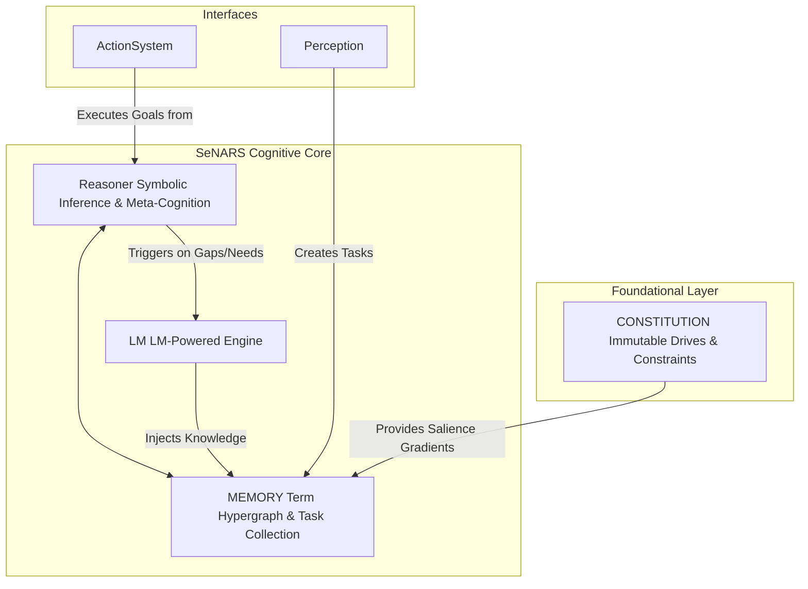

# **SeNARS Cognitive System Specification**

## *A Blueprint for Principled and Pragmatic Neuro-Symbolic Cognition*

A complete cognitive architecture designed to achieve a synergistic union of formal symbolic reasoning and the semantic
power of Large Language Models (LMs).

- Its foundation is a **Unified Knowledge Hypergraph**, a sophisticated data structure composed of immutable **`Term`s
  ** (concepts) and stateful, evidence-backed **`Task`s** (beliefs, goals, questions).
- The system operates in a **Cycle**, a discrete reasoning loop governed by a principle of **Economic Attention**, which
  pragmatically prioritizes tasks based on their relevance, urgency, confidence, and predicted effort.
- All reasoning is guided by an immutable **`Constitution`** of foundational motives.
- The architecture features a dual-engine design: a symbolic **Reasoner** performs rigorous, explainable inference,
  while a neuro-symbolic **LM** leverages LMs for creativity, grounding, and natural language fluency.
- Through a powerful **Meta-Cognitive** feedback loop, SeNARS is designed for recursive self-improvement, creating a
  robust and transparent foundation for genuinely cognitive AI.

---

### **1. Core Principles**

1. **Unified Knowledge Hypergraph**: All knowledge is represented in a unified structure of immutable `Term`s and
   stateful `Task`s, eliminating artificial distinctions between data types.
2. **Term/Task Distinction**: The architecture strictly separates the immutable vocabulary of concepts (`Term`) from the
   mutable, evidence-backed statements about them (`Task`), ensuring computational efficiency and conceptual clarity.
3. **Pragmatic Economic Attention**: The system's focus (`priority`) is the result of a continuous economic calculation,
   balancing a task's importance, urgency, and confidence against its predicted computational effort.
4. **Motive-Driven Cognition**: Reasoning is guided by a foundational, immutable **`Constitution`** of top-level goals (
   Drives) that propagate relevance and purpose throughout the knowledge graph.
5. **Recursive Meta-Cognition**: The system applies its own reasoning engine to analyze and correct its failures, driven
   by an intrinsic need to maintain its own cognitive integrity.
6. **Neuro-Symbolic Synergy**: A symbolic **Reasoner** provides rigorous, explainable inference, while a **LM** provides
   the semantic grounding, creativity, and natural language interface required for real-world interaction.

---

### **2. System Architecture**



---

### **3. Knowledge Representation**

#### **3.1 `Term`: The Immutable Vocabulary**

- **Purpose**: A unique, canonical representation of a concept or a relationship.
- **Structure**:
    - `key: string`: The formal, Narsese-inspired syntax.
    - `embedding: number[]`: A dense vector representation from the `LM`.
    - `complexity: number`: A static measure of structural complexity used for effort estimation.
- **Syntax Table**:
  | Relationship | SeNARS v8.0 Syntax | Example | Meaning |
  | -------------------- | --------------------------- | ------------------------------------- | ----------------------------------------------------------------------- |
  | **Inheritance**      | `(term --> term)`           | `(cat --> mammal)`                    | "A cat is a kind of
  mammal." (Taxonomic)                                |
  | **Implication**      | `(term ==> term)`           | `((&, event, smoke) ==> fire)`        | "If there is smoke,
  then there is fire." (Predictive/Causal)            |
  | Instance | `(term {-- term)`           | `(garfield {-- cat)`                   | "Garfield is an instance of a
  cat."                                     |
  | Property | `(term --} term)`           | `(cat --} furry)`                     | "A cat has the property of being
  furry."                                |
  | Negation | `(--, term)`                | `(--, cat)`                           | The concept of "not a
  cat."                                             |
  | Conjunction | `(&, term, term, ...)`      | `(&, cat, black)`                     | The concept of "a black
  cat."                                           |

#### **3.2 `Task`: The Stateful Cognitive Atom**

- **Purpose**: A specific, evidence-backed statement (belief, goal, or question) about a `Term`.
- **Structure**:
    - `id: string`: Unique identifier for this specific cognitive act.
    - `termKey: string`: Foreign key pointing to a `Term`'s key.
    - `punctuation: '.' | '!' | '?'`: Belief (Judgment), Goal, or Question.
    - `state`:
        - `priority: number`: The current attentional focus score.
        - `truthValue: { frequency: number, confidence: number }`: Evidence-based belief strength.
        - `stamp: { creationTime: number, occurrenceTime?: number }`: For temporal and causal reasoning.

---

### **4. The Constitution**

- **Purpose**: An immutable, pre-loaded set of `Task`s defining the system's foundational motivations and safety
  constraints.
- **Content Examples**:
    - **Drives (High-Priority, Permanent Goals)**:
        - `AcquireKnowledge!`
        - `ReduceUncertainty!`
        - `MaintainCoherence!` (Resolve contradictions)
        - **`MaintainCognitiveIntegrity!`**: The core meta-cognitive drive for self-improvement.
    - **Constraints (High-Confidence Beliefs about Negative Outcomes)**:
        - `((&, self, cause_harm) ==> NEGATIVE_OUTCOME).`

---

### **5. The Cycle (Core Loop)**

```pseudocode
function cognitiveCycle():
    // 1. Perception: Ingest new information from the world.
    newTasks = Perception.processEvents()
    Memory.addTasks(newTasks)

    // 2. Prioritization: Apply economic attention to all tasks.
    for task in Memory.getAllTasks():
        task.priority = calculatePriority(task)

    // 3. Inference: Reason upon the most salient tasks.
    focusSet = Memory.getHighestPriorityTasks(k=20)
    derivedTasks = Reasoner.performInference(focusSet, Memory.hypergraph)
    Memory.addTasks(derivedTasks)

    // 4. Meta-Cognition: Detect and analyze reasoning failures.
    contradictions = findContradictions(derivedTasks, Memory)
    if contradictions:
        metaTasks = MetaCognition.analyzeFailures(contradictions)
        Memory.addTasks(metaTasks) // These will have high priority

    // 5. Semantic Enrichment & Action
    for task in (derivedTasks + metaTasks):
        if isNovelTerm(task.termKey):
            LM.bootstrapTerm(task.termKey) // Ground new concepts

    actionableGoals = Memory.findExecutableGoals() // Find high-confidence, high-priority goals
    ActionSystem.execute(actionableGoals)
```

---

### **6. Core Mechanisms**

#### **6.1 Dynamic Priority Calculation (Economic Attention)**

`calculatePriority(task)` is a function `f(I, U, C, E)` that balances four factors:

1. **`I` (Importance)**: The task's relevance to `Constitution` Drives and its causal leverage (how many other important
   tasks depend on it).
2. **`U` (Urgency)**: The task's recency and its relevance to the current context.
3. **`C` (Confidence)**: The task's `truthValue.confidence` (clarity).
4. **`E` (Effort)**: The inverse of the `complexity` of the task's `Term`.

#### **6.2 Reasoner & Meta-Cognition (Recursive Self-Awareness)**

- **Reasoner Function**: Derives new `Task`s from existing ones using formal inference rules (deduction, induction,
  abduction, analogy).
- **Meta-Cognitive Loop**:
    1. **Trigger**: The Reasoner detects a `Contradiction` (e.g., deriving `A.` when `(--, A).` has high confidence).
    2. **Activation**: The `MaintainCognitiveIntegrity!` Drive gives the `Contradiction` task extremely high priority.
    3. **Analysis (Backward Reasoning)**: The Reasoner performs abduction on the contradictory `Task`s, tracing their
       derivations backward to find the premise `Task` with the lowest confidence that contributed to the error.
    4. **Remediation**: The `truthValue` of the faulty premise is lowered, and a new `Goal` is generated (e.g.,
       `FindAlternativeFor(faulty_term)!`) to task the `LM` with finding a better explanation.

#### **6.3 The LM (Neuro-Symbolic Engine)**

- **Purpose**: To bridge the symbolic Reasoner with the semantic world of LMs.
- **Capabilities (as functions)**:
    - `bootstrapTerm(termKey)`: Generates an `embedding` and `naturalLanguageHint` for a new `Term`.
    - `findRelatedTerms(termKey)`: Performs semantic search using vector embeddings to find analogous concepts.
    - `generateHypothesis(context: Task[])`: Takes a set of `Task`s describing a knowledge gap and uses an LM to propose
      a new, low-confidence relational `Term` to resolve it.
    - `explainDerivation(trace: Task[])`: Translates a logical chain of `Task`s into a fluent, human-readable narrative
      for Explainable AI (XAI).
    - `translateToAction(goalTask: Task)`: Converts a symbolic `Goal` into a concrete, executable command (e.g., an API
      call or script).
