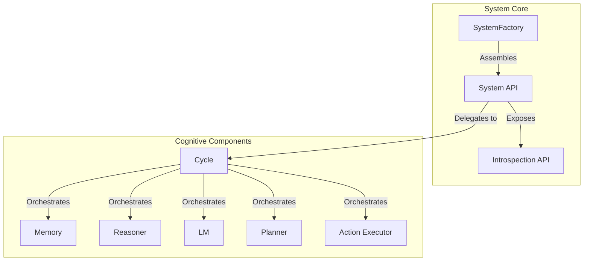

# SeNARS 🧠

A Neuro-Symbolic Reasoning System

---

## What is SeNARS?

SeNARS is a **cognitive architecture** that creates a powerful synergy between:

- **🧠 Symbolic Reasoning**: Rigorous, explainable inference
- **🤖 Neural Processing**: Creative, semantic understanding

It provides a foundation for building **transparent**, **adaptive**, and **complex-reasoning** AI systems.

---

## Core Concepts

### 🔤 Term
Immutable representation of a concept
- Example: `cat`, `(cat --> animal)`

### 🎯 Task
Stateful unit of cognitive work
- Belief `.` | Goal `!` | Question `?`
- Truth values (frequency, confidence)
- Dynamic priorities

### 💾 Memory
Unified knowledge hypergraph
- Stores Terms & Tasks
- Specialized indexes for retrieval
- Forgetting mechanism for focus

---

## System Architecture



---

## Key Features

| Feature | Description |
|---------|-------------|
| 🧠 **Dual-Engine** | Symbolic reasoning + Neural creativity |
| 🔄 **Meta-Cognition** | Self-improvement through failure detection |
| 🏛️ **Immutable Constitution** | Core motives & safety constraints |
| 🎯 **Economic Attention** | Prioritizes cognitive resources |
| 🔌 **Pluggable Design** | Extend or replace any component |

---

## Getting Started

### Prerequisites
- Node.js (v16 or higher)
- npm

### Installation
```bash
npm install
```

### Run Demos
```bash
npm run start:demo
```

Start with `showcase-demo.js` for a comprehensive tour.

### Run Tests
```bash
npm test
```

---

## Development Roadmap

1. **Core Cognition**
   - Self-tuning planners
   - Principled goal refinement

2. **Knowledge Architecture**
   - Vector database integration
   - Hybrid memory systems

3. **Cognitive Tooling**
   - Interactive visualizer
   - Self-diagnosis of failures

4. **Symbiotic Intelligence**
   - Explainable AI narratives
   - Proactive augmentation

---

For detailed technical information, see the [Conceptual Overview](./docs/SYSTEM_OVERVIEW.md).
