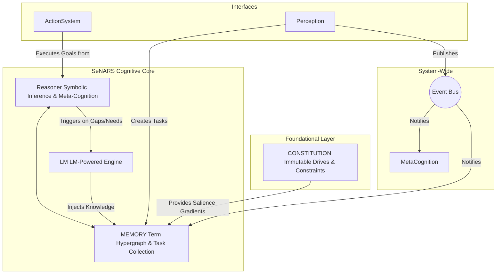

# **SeNARS Cognitive System**

## *A Blueprint for Principled and Pragmatic Neuro-Symbolic Cognition*

A complete cognitive architecture designed to achieve a synergistic union of formal symbolic reasoning and the semantic
power of Large Language Models (LMs).

- Its foundation is a **Unified Knowledge Hypergraph**, a sophisticated data structure composed of immutable **`Term`s
  ** (concepts) and stateful, evidence-backed **`Task`s** (beliefs, goals, questions).
- The system operates in a **Cycle**, a discrete reasoning loop governed by a principle of **Economic Attention**, which
  pragmatically prioritizes tasks based on their relevance, urgency, confidence, and predicted effort.
- All reasoning is guided by an immutable **`Constitution`** of foundational motives.
- The architecture features a dual-engine design: a symbolic **Reasoner** performs rigorous, explainable inference,
  while a neuro-symbolic **LM** leverages LMs for creativity, grounding, and natural language fluency.
- Through a powerful **Meta-Cognitive** feedback loop, SeNARS is designed for recursive self-improvement, creating a
  robust and transparent foundation for genuinely cognitive AI.

---

## **Conceptual Overview**

1. **Unified Knowledge Hypergraph**: ✅ Implemented with `Term` and `Task` classes
2. **Term/Task Distinction**: ✅ Strictly maintained in the implementation
3. **Pragmatic Economic Attention**: ✅ Priority calculation implemented
4. **Motive-Driven Cognition**: ✅ Constitution with drives and constraints
5. **Recursive Meta-Cognition**: ✅ Basic contradiction detection and analysis
6. **Neuro-Symbolic Synergy**: ✅ Integration with transformer models via LM class

---

## **System Architecture**



### **Event Bus Architecture**

To enhance modularity and extensibility, the system uses a central **`EventBus`**. Components can publish events (e.g.,
`NewTasksCreated`) and subscribe to them, allowing for decoupled communication and making it easier to add new
functionality without modifying core components.

---

## **Features**

- **Symbolic Reasoning**: Formal inference with deduction, induction, abduction, and analogy
- **Neuro-Symbolic Integration**: Embedding-based semantic similarity and term grounding
- **Attention Mechanism**: Economic attention model for task prioritization
- **Meta-Cognition**: Contradiction detection with an extensible, strategy-pattern-based resolution system.
- **Planning**: A sophisticated, graph-integrated Hierarchical Task Network (HTN) planner that decomposes complex goals
  by querying planning knowledge stored directly in the knowledge graph.
- **Temporal Reasoning**: Time-aware task processing

---

## **Implementation Details**

This repository contains a working implementation of the SeNARS cognitive system. The system includes all core
components and demonstrates the key principles of neuro-symbolic cognition.

### **Knowledge Representation**

#### **`Term`: The Immutable Vocabulary**

- **Purpose**: A unique, canonical, and *intelligent* representation of a concept or relationship.
- **Structure**:
    - `key: string`: The formal, Narsese-inspired syntax.
    - `embedding: number[]`: A dense vector representation from the `LM`.
    - `complexity: number`: A static measure of structural complexity.
- **Intelligence**: The `Term` class is not just a data container. It parses its own key upon instantiation, caching its
  Narsese structure. This allows for efficient access to its components (e.g., `term.subject`, `term.predicate`) as full
  `Term` instances, making the rest of the system's code cleaner and more performant.

#### **`Task`: The Stateful Cognitive Atom**

- **Purpose**: A specific, evidence-backed statement (belief, goal, or question) about a `Term`.
- **Structure**:
    - `id: string`: Unique identifier for this specific cognitive act.
    - `termKey: string`: Foreign key pointing to a `Term`'s key.
    - `punctuation: '.' | '!' | '?'`: Belief (Judgment), Goal, or Question.
    - `state`:
        - `priority: number`: The current attentional focus score.
        - `truthValue: { frequency: number, confidence: number }`: Evidence-based belief strength.
        - `stamp: { creationTime: number, occurrenceTime?: number }`: For temporal and causal reasoning.

### **The Constitution**

- **Purpose**: An immutable, pre-loaded set of `Task`s defining the system's foundational motivations and safety
  constraints.
- **Content**:
    - **Drives (High-Priority, Permanent Goals)**:
        - `AcquireKnowledge!`
        - `ReduceUncertainty!`
        - `MaintainCoherence!` (Resolve contradictions)
        - **`MaintainCognitiveIntegrity!`**: The core meta-cognitive drive for self-improvement.
    - **Constraints (High-Confidence Beliefs about Negative Outcomes)**:
        - `((&, self, cause_harm) ==> NEGATIVE_OUTCOME).`

### **The Cycle (Core Loop)**

The cognitive cycle is implemented in `src/system/Cycle.js` and follows the specification:

1. **Perception**: Ingest new information from the world (implemented in `src/system/Perception.js`).
2. **Prioritization**: Apply economic attention to all tasks.
3. **Inference**: Reason upon the most salient tasks.
4. **Meta-Cognition**: Detect and analyze reasoning failures.
5. **Semantic Enrichment & Action**: Process new terms and execute goals.

### **Core Mechanisms**

- **Dynamic Priority Calculation (Economic Attention)**: Implemented in `src/system/Cycle.js`
- **Reasoner & Meta-Cognition**: Basic inference rules (deduction, induction, abduction, analogy) implemented in
  `src/reasoner/`. Basic contradiction detection in `src/system/MetaCognition.js`
- **The LM (Neuro-Symbolic Engine)**: Integration with transformer models via `@xenova/transformers` in `src/lm/LM.js`.
  Term embedding generation implemented.

### **Recent Refactoring**

The codebase has undergone significant refactoring to improve modularity and stability. Key improvements include:

- **Stabilized Core System**: Fixed integration test failures in the Reasoner and Cycle.
- **Refactored Key Modules**: `Cycle.js`, `MetaCognition.js`, `Perception.js`, `Planner.js`, `ActionExecutor.js`, and
  `LM.js` have been refactored to extract logic into more focused modules (e.g., `PriorityManager`,
  `ContradictionAnalyzer`).
- **Suppressed ONNX Runtime Warnings**: Cleaned up console output by suppressing ignorable warnings from the underlying
  ONNX runtime.

---

## **Getting Started & Usage**

### **Prerequisites**

- Node.js (v14 or higher)
- npm

### **Installation**

```bash
npm install
```

### **Running Demos and Tests**

To explore the system's capabilities, use the interactive demo runner:

```bash
npm run start:demo
```

This command will present you with a list of available demos. You can choose to run a specific demo or all of them
sequentially. This is the best way to see the system in action.

Available demos include:

1. **Math Inference Demo**: Tests logical inference with mathematical relationships
2. **Planning Demo**: Demonstrates goal-directed behavior and planning
3. **Comprehensive System Demo**: Full system demonstration with complex knowledge
4. **NLP Integration Demo**: Shows natural language processing capabilities
5. **Contradiction Resolution Demo**: Demonstrates meta-cognitive capabilities

To run the full test suite:

```bash
npm test
```

### **Usage as a Library**

You can easily integrate the SeNARS system into your own projects.

```javascript
const { System, Task, parseTerm } = require('./src');

async function runSystem() {
    // 1. Initialize the system
    const system = new System();
    await system.initialize();

    // 2. Add knowledge to the system
    const belief = new Task(
        parseTerm('(cat --> animal)'),
        '.',
        { frequency: 1.0, confidence: 0.9 }
    );
    await system.addTasks([belief]);

    console.log('System initialized and belief added.');

    // 3. Run the cognitive cycle
    for (let i = 0; i < 10; i++) {
        const output = await system.runCycle();
        console.log(`Cycle ${i+1} complete. Derived ${output.derivedTasks} new tasks.`);
    }

    // 4. Query and manipulate tasks
    const animalBeliefs = system.queryTasks({ termKey: '(cat --> animal)', punctuation: '.' });
    console.log('Found animal beliefs:', animalBeliefs);

    system.stop();
}

runSystem();
```

---

## **Roadmap**

### **Advanced Capabilities**

- **Systematic Evaluation and Benchmarking**: Develop a comprehensive cognitive test suite and track performance metrics
  for speed, knowledge acquisition, and goal achievement.
- **Advanced Meta-Cognition and Self-Improvement**: Implement automated bug-fixing and dynamic resource management.
- **Richer Interfaces and Embodiment**: Integrate with robotic platforms and develop sophisticated conversational
  interfaces.
- **Long-Term Memory and Learning**: Implement forgetting mechanisms and memory consolidation.

### **Community and Growth**

- **Foster an Open-Source Community**: Create comprehensive documentation, tutorials, and encourage collaboration.
