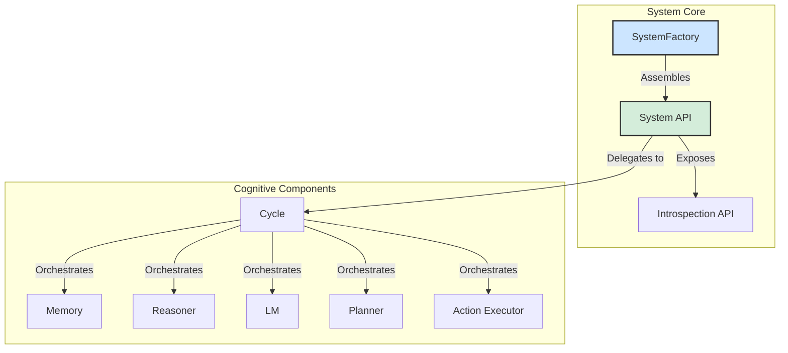

# SeNARS Cognitive System

## A Blueprint for Principled and Pragmatic Neuro-Symbolic Cognition

SeNARS is a cognitive architecture designed to achieve a synergistic union of formal symbolic reasoning and the semantic
power of Large Language Models (LMs). Its foundation is a **Unified Knowledge Hypergraph** composed of immutable *
*`Term`s** (concepts) and stateful, evidence-backed **`Task`s** (beliefs, goals, questions). The system operates in a
discrete **`Cycle`**, a reasoning loop governed by a principle of **Economic Attention**, which pragmatically
prioritizes tasks based on their relevance, urgency, confidence, and predicted effort.

- **Dual-Engine Design**: A symbolic **Reasoner** performs rigorous, explainable inference, while a neuro-symbolic **LM
  ** leverages Large Language Models for creativity, grounding, and natural language fluency.
- **Meta-Cognitive Loop**: Through a powerful **Meta-Cognitive** feedback loop, SeNARS is designed for recursive
  self-improvement.
- **Immutable Foundation**: All reasoning is guided by an immutable **`Constitution`** of foundational motives.

---

## Design Principles

- **API-Driven & Pluggable Architecture**: The system is built around a clean, observable API. Core components (
  `Memory`, `Reasoner`, `LM`, etc.) are assembled by a central `SystemFactory` using dependency injection, allowing for
  easy extension and replacement of components.
- **Unified Configuration**: All system parameters are managed through a single, hierarchical configuration object,
  making the system's behavior transparent and easy to customize.
- **Introspection as a First-Class Citizen**: A dedicated `Introspection` API (`system.introspection`) provides a
  comprehensive set of tools for observing the system's internal state, querying memory, and subscribing to events,
  designed explicitly to support GUIs and other external tools.
- **Explicit State Management**: All cognitive state is explicitly stored within `Task`s in the central `Memory`
  component.
- **Strategy over Implementation**: For complex problems like contradiction resolution and planning, the system favors a
  `Strategy` pattern, allowing for the dynamic selection of the best algorithm for a given context.

---

## System Architecture

The SeNARS architecture is designed for modularity and extensibility.



The `SystemFactory` is the main entry point for creating a new system. It instantiates all the necessary cognitive
components and injects them into the main `System` object. The `System` object, in turn, exposes a clean public API for
interacting with the system, including the powerful `Introspection` API for observability. The `Cycle` object
orchestrates the flow of information and reasoning between all other components.

---

## Getting Started

### Prerequisites

- Node.js (v16 or higher)
- npm

### Installation

```bash
npm install
```

### Running the Interactive Demo

To explore the system's capabilities, use the interactive demo runner:

```bash
npm run start:demo
```

This will present a categorized list of available demos, providing the best way to see the system in action. The
`showcase-demo.js` is the recommended starting point for new users.

### Running Tests

```bash
npm test
```

---

## Usage as a Library

Integrate the SeNARS system into your own projects. The system is designed to be used as a library, with a clean,
promise-based, and observable API.

```javascript
import {SystemFactory, Task, parseTerm} from 'senars';

// Example of a custom configuration to override the defaults
const customConfig = {
    // Make the system forget things faster for this demo
    memory: {
        MAINTENANCE_CYCLE_FREQUENCY: 3,
    },
    // Use the HTN planner (default)
    planner: {
        strategy: 'HTN',
    }
};

async function runSystem() {
    // 1. Create a system instance using the factory
    console.log('Creating and initializing system with custom config...');
    const system = await SystemFactory.createSystem(customConfig);
    console.log('System created and initialized.');

    // 2. Subscribe to events using the Introspection API
    console.log('Subscribing to '
    SystemCycleEnded
    ' event...'
)
    ;
    system.introspection.on('SystemCycleEnded', (result) => {
        console.log(`EVENT: Cycle ended. Derived ${result.derivedTasks} new tasks.`);
    });

    // 3. Add knowledge to the system
    console.log('Adding knowledge...');
    const beliefTerm = parseTerm('(dog --> mammal)');
    const belief = new Task(beliefTerm, '.');
    await system.addTasks([belief]);

    const questionTerm = parseTerm('(<dog> --> warm_blooded)');
    const question = new Task(questionTerm, '?');
    await system.addTasks([question]);

    // 4. Run the cognitive cycles
    console.log('Running 5 cognitive cycles...');
    for (let i = 0; i < 5; i++) {
        await system.runCycle();
        const status = system.introspection.getStatus();
        console.log(`  Cycle ${i + 1}: ${status.memory.shortTermTasks} tasks in STM.`);
    }

    // 5. Query the final state using the Introspection API
    console.log('Querying for the answer...');
    const answers = system.introspection.queryTasks({termKey: '(<dog> --> warm_blooded)', punctuation: '.'});

    if (answers.length > 0) {
        const bestAnswer = answers.sort((a, b) => b.state.truthValue.confidence - a.state.truthValue.confidence)[0];
        console.log(`ANSWER: The system believes "(<dog> --> warm_blooded)" is TRUE with confidence ${bestAnswer.state.truthValue.confidence.toFixed(2)}`);
    } else {
        console.log('ANSWER: The system has not yet concluded an answer.');
    }

    // 6. Stop the system
    system.stop();
    console.log('System stopped.');
}

runSystem().catch(console.error);
```

### Language Model Configuration

The system can be configured to use different Large Language Model (LLM) providers. This is controlled by the
`LLM_PROVIDER` setting in the `LM` section of the configuration.

#### Supported Providers

- **`xenova` (Default for testing):** Uses the [`@xenova/transformers`](https://github.com/xenova/transformers.js)
  library to run models directly within the Node.js process. This is convenient for testing and development as it
  requires no external setup, but it may not be suitable for production due to performance and logging verbosity.
- **`ollama` (Recommended for development):** Uses a local [Ollama](https://ollama.com/) server to run LLMs. This is the
  recommended approach for local development as it offers better performance and a wider range of models.

#### Setting up Ollama

1. **Install Ollama:** Follow the instructions on the [Ollama website](https://ollama.com/) to download and install it
   on your system.
2. **Pull a model:** You need to have a model available that matches the `TEXT_GENERATION_MODEL` setting in your
   configuration. We recommend starting with `llama3.1`. You can pull it by running:
   ```bash
   ollama pull llama3.1
   ```
3. **Configure the system:** In your configuration object, set the `LLM_PROVIDER` to `'ollama'` and ensure the
   `TEXT_GENERATION_MODEL` matches the model you pulled. You can also specify the `OLLAMA_BASE_URL` if your Ollama
   server is not running on the default `http://127.0.0.1:11434`.

   ```javascript
   const customConfig = {
       LM: {
           LLM_PROVIDER: 'ollama',
           TEXT_GENERATION_MODEL: 'llama3.1', // Make sure this model is available in Ollama
           // OLLAMA_BASE_URL: 'http://localhost:11434' // Optional
       }
   };
   ```

### Planning Strategies

The system supports multiple planning algorithms. The active planner can be set in the configuration object passed to
`SystemFactory`.

- **`HTN` (Hierarchical Task Network):** The default and recommended planner. It's robust and well-suited for complex,
  multi-step problems.
- **`AStar`:** An alternative heuristic-based search planner. **Note:** This planner is currently experimental and has
  known bugs.

---

## Development Roadmap

This project has a long-term vision for creating a safe, transparent, and symbiotic cognitive partner. The roadmap is
organized into several tracks:

1. **Core Cognition & Self-Improvement**: Focuses on making the reasoning core more adaptive, principled, and capable of
   safely evolving its own foundational values.
2. **Knowledge Architecture & Scalability**: Aims to build a massively scalable, persistent, and distributed knowledge
   architecture, enabling a "society of minds."
3. **Cognitive Tooling & Autonomous Development**: Involves creating tools for visualization and debugging, with the
   ultimate goal of having the system accelerate its own development.
4. **Symbiotic Intelligence & Interfaces**: Centers on developing truly collaborative reasoning, where the AI can
   explain its thinking and act as a proactive cognitive augmenter for the user.

---

## Contributing

We welcome contributions! Please follow these guidelines:

1. Fork the repository.
2. Create a new branch for your feature or bug fix.
3. Follow the coding style: The code should be clean, self-documenting, and elegant.
4. Write tests for any new functionality.
5. Submit a pull request with a clear description of your changes.
