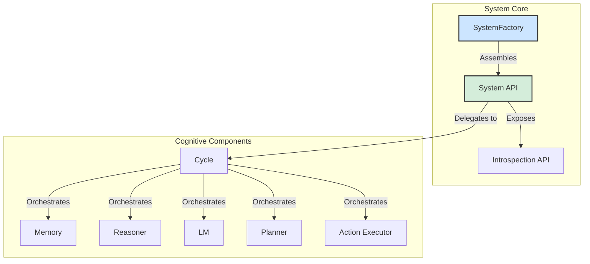

# SeNARS: A Neuro-Symbolic Reasoning System

**SeNARS** is a cognitive architecture engineered to create a powerful synergy between formal symbolic reasoning and the
semantic richness of Large Language Models (LMs). It provides a robust foundation for building AI systems that are
transparent, adaptive, and capable of complex, multi-step reasoning.

At its heart is a **Unified Knowledge Hypergraph** of immutable **`Term`s** (concepts) and stateful **`Task`s** (
beliefs, goals, questions). The system operates in a discrete **`Cycle`**, a core reasoning loop governed by a principle
of **Economic Attention**, which pragmatically prioritizes cognitive resources based on relevance, urgency, and
confidence.

- **🧠 Dual-Engine Cognition**: A symbolic **Reasoner** for rigorous, explainable inference, complemented by a
  neuro-symbolic **LM** for creativity, semantic grounding, and natural language fluency.
- **🔄 Meta-Cognitive Loop**: A powerful feedback mechanism for recursive self-improvement, allowing the system to detect
  and correct its own reasoning failures.
- **🏛️ Immutable Constitution**: A set of core, unchangeable motives and constraints that ensures all reasoning remains
  aligned with foundational principles.

This project is in a confident prototype phase, backed by years of academic research, and is now focused on accelerating
growth and attracting a community of developers and researchers.

---

## Key Design Principles

SeNARS is built on a set of principles that ensure a modular, transparent, and extensible system, making it an ideal
platform for both research and development.

- **API-Driven & Pluggable**: Core components (`Memory`, `Reasoner`, `LM`) are assembled via dependency injection,
  allowing any part of the system to be extended or replaced.
- **Unified Configuration**: A single, hierarchical configuration object makes the system's behavior transparent and
  easy to customize.
- **Introspection First**: A rich `Introspection` API provides comprehensive tools for observing the system's internal
  state, designed explicitly to support GUIs and external monitoring.
- **Explicit State Management**: All cognitive state is explicitly stored within `Task`s in the central `Memory`
  component, providing a single source of truth.
- **Strategy Over Implementation**: For complex challenges like planning or contradiction resolution, the system uses a
  `Strategy` pattern, allowing for dynamic selection of the best algorithm for a given context.

---

## System Architecture

The SeNARS architecture is designed for modularity and clarity.



The `SystemFactory` is the main entry point, instantiating and assembling all cognitive components. The `System` object
exposes a clean public API, including the powerful `Introspection` API for observability, while the `Cycle` orchestrates
the reasoning loop.

---

## Core Concepts

SeNARS is built on a few core concepts that work together to create its cognitive capabilities.

- **`Term`**: An **immutable** representation of a concept. Terms are the fundamental building blocks of knowledge, from
  simple atoms like `cat` to complex relationships like `(cat --> animal)`. Their immutability ensures conceptual
  stability.

- **`Task`**: A **stateful** unit of cognitive work, representing a belief, goal, or question. Each `Task` wraps a
  `Term` and attaches dynamic state to it, such as a **truth value** (confidence) and a **priority** score for the
  attention mechanism.

- **`Memory`**: The central **knowledge hypergraph** that stores and manages all `Term`s and `Task`s. It uses
  specialized indexes for efficient retrieval and a forgetting mechanism to prune irrelevant information, keeping the
  system focused.

- **`Cycle`**: The **heartbeat** of the system. In a continuous loop, the system takes in new information, prioritizes
  tasks, performs reasoning, and executes actions. This cycle drives the emergent, stream-of-consciousness-like behavior
  of the system.

For a more detailed explanation of these concepts, see the [Conceptual Overview](./docs/SYSTEM_OVERVIEW.md).

---

## Getting Started

### Prerequisites

- Node.js (v16 or higher)
- npm

### Installation

```bash
npm install
```

### See It in Action: Interactive Demos

The best way to explore the system's capabilities is to run the interactive demo runner:

```bash
npm run start:demo
```

This will present a categorized list of available demos. The `showcase-demo.js` is the recommended starting point for
new users, offering a comprehensive tour of the system's features.

### Running Tests

To verify the integrity of the system and run all unit and integration tests:

```bash
npm test
```

---

## Using SeNARS as a Library

SeNARS is designed to be integrated into any Node.js project. Its API is clean, promise-based, and highly observable.
Here is a simple example of how to use it:

```javascript
import { SystemFactory, Task, parseTerm } from 'senars';

async function main() {
  // 1. Create a system instance with default configuration
  const system = await SystemFactory.createSystem();

  // 2. Add knowledge to the system (a belief)
  // This tells the system that "a cat is a type of mammal"
  const belief = new Task(parseTerm('(cat --> mammal)'), '.');
  await system.addTasks([belief]);

  // 3. Ask the system a question
  // This asks the system to infer if a cat is warm-blooded
  const question = new Task(parseTerm('(<cat> --> warm_blooded)'), '?');
  await system.addTasks([question]);

  // 4. Run cognitive cycles to allow the system to reason
  console.log('Running cognitive cycles...');
  for (let i = 0; i < 5; i++) {
    await system.runCycle();
  }

  // 5. Query the system's memory for the answer
  const answers = system.introspection.queryTasks({
    termKey: '(<cat> --> warm_blooded)',
    punctuation: '.'
  });

  if (answers.length > 0) {
    const bestAnswer = answers[0];
    console.log(
      `System concluded "(<cat> --> warm_blooded)" with confidence: ${bestAnswer.state.truthValue.confidence.toFixed(2)}`
    );
  } else {
    console.log('System has not yet reached a conclusion.');
  }

  // 6. Stop the system
  system.stop();
}

main().catch(console.error);
```

For more detailed examples and deeper integration guides, please refer to the runnable demos in the `/tests/demos`
directory.

### Language Model Configuration

SeNARS supports multiple Large Language Model (LLM) providers, controlled via the configuration object. The default
provider, `@xenova/transformers`, runs locally and is great for testing, while the recommended provider for development
is `Ollama`, which offers better performance and a wider selection of models. See the `default-config.js` file for more
details on configuration options.

### Planning Strategies

The system includes multiple planning algorithms, such as **HTN (Hierarchical Task Network)** and an experimental **A***
planner. The desired strategy can be easily set in the system configuration, allowing you to choose the best fit for
your application's needs.

---

## Development Roadmap

This project has a long-term vision for creating a safe, transparent, and symbiotic cognitive partner. The roadmap is
organized into several tracks:

1. **Core Cognition & Self-Improvement**: Focuses on making the reasoning core more adaptive, principled, and capable of
   safely evolving its own foundational values.
2. **Knowledge Architecture & Scalability**: Aims to build a massively scalable, persistent, and distributed knowledge
   architecture, enabling a "society of minds."
3. **Cognitive Tooling & Autonomous Development**: Involves creating tools for visualization and debugging, with the
   ultimate goal of having the system accelerate its own development.
4. **Symbiotic Intelligence & Interfaces**: Centers on developing truly collaborative reasoning, where the AI can
   explain its thinking and act as a proactive cognitive augmenter for the user.

---

## Contributing

We welcome contributions! Please follow these guidelines:

1. Fork the repository.
2. Create a new branch for your feature or bug fix.
3. Follow the coding style: The code should be clean, self-documenting, and elegant.
4. Write tests for any new functionality.
5. Submit a pull request with a clear description of your changes.
