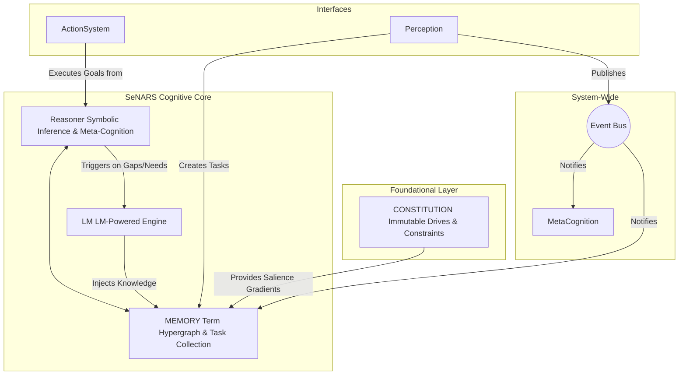

# SeNARS Cognitive System

## A Blueprint for Principled and Pragmatic Neuro-Symbolic Cognition

SeNARS is a cognitive architecture designed to achieve a synergistic union of formal symbolic reasoning and the semantic power of Large Language Models (LMs). Its foundation is a **Unified Knowledge Hypergraph** composed of immutable **`Term`s** (concepts) and stateful, evidence-backed **`Task`s** (beliefs, goals, questions). The system operates in a discrete **`Cycle`**, a reasoning loop governed by a principle of **Economic Attention**, which pragmatically prioritizes tasks based on their relevance, urgency, confidence, and predicted effort.

- **Dual-Engine Design**: A symbolic **Reasoner** performs rigorous, explainable inference, while a neuro-symbolic **LM** leverages Large Language Models for creativity, grounding, and natural language fluency.
- **Meta-Cognitive Loop**: Through a powerful **Meta-Cognitive** feedback loop, SeNARS is designed for recursive self-improvement.
- **Immutable Foundation**: All reasoning is guided by an immutable **`Constitution`** of foundational motives.

---

## Design Principles

- **Modularity and Decoupling**: Components are designed to be as independent as possible, communicating through a central `EventBus`.
- **Explicit State Management**: All cognitive state is explicitly stored within `Task`s in the central `Memory` component.
- **Strategy over Implementation**: For complex problems like contradiction resolution and planning, the system favors a `Strategy` pattern, allowing for the dynamic selection of the best algorithm for a given context.
- **Meta-Cognition as a First-Class Citizen**: The `MetaCognition` module is a core component, ensuring the system is fundamentally designed to analyze and correct its own reasoning processes.
- **Pragmatism under Scarcity**: The principle of Economic Attention ensures computational resources are always allocated to the most salient cognitive activities.

---

## System Architecture



---

## Features

This manifest represents the currently implemented and tested functionality of the SeNARS cognitive system.

### Core Knowledge Representation
- **Term System**: Immutable, Narsese-based concept representation with intelligent parsing, semantic grounding, and component access.
- **Task System**: Stateful cognitive acts (beliefs, goals, questions) with evidence-based truth values, priority scores, and temporal stamps.

### Memory Management
- **Dual Memory System**: Short-term and long-term memory with automatic consolidation and time-based forgetting mechanisms.
- **Knowledge Indexing**: Beliefs, implications, and costs are indexed for efficient retrieval and querying.

### Reasoning Engine
- **Inference Rules**: Supports deduction, induction, abduction, analogy, modus ponens, and inheritance chaining.
- **Meta-Cognition**: Detects and classifies contradictions, with multiple resolution strategies (revision, evidence gathering, causal analysis).
- **Planning**:
    - **HTN Planning**: Decomposes complex goals into primitive actions.
    - **A* Planning**: Heuristic search-based planning.
    - Dynamic strategy selection and plan cost calculation.

### Temporal Reasoning
- **Comprehensive Analysis**: Infers temporal relationships, detects patterns and anomalies, and predicts future events.

### Language Model Integration
- **Neuro-Symbolic Bridge**: Handles embedding generation, hypothesis generation/evaluation, explanation generation, Q&A, and plan repair.
- **Advanced Capabilities**: Supports proactive knowledge enrichment and counterfactual reasoning.

### Attention & Control
- **Economic Attention**: Dynamically calculates and allocates attention based on task priority.
- **Event-Driven Architecture**: Core components are decoupled via a central `EventBus`.
- **Constitutional Core**: System behavior is anchored by immutable drives and safety constraints.

### Action Execution
- **Flexible Execution**: Supports primitive, parallel, conditional, and hierarchical action execution with rollback mechanisms.

### Narsese Support
- **Rich Syntax**: Supports atomic terms, inheritance, implication, negation, conjunction, disjunction, set relations, and nested expressions.

---

## Core Concepts

### `Term`: The Immutable Vocabulary
A `Term` is the unique, canonical, and *intelligent* representation of a concept. It parses its own Narsese key upon instantiation, making the rest of the system's code cleaner and more performant.

```javascript
// Example: src/core/Term.js
class Term {
    constructor(key) {
        this.key = key; // e.g., '(<cat> --> mammal)'
        // Internal parser populates component properties
    }

    // Smart accessors for component terms
    get subject() { /* ... */ }
    get predicate() { /* ... */ }
}
```

### `Task`: The Stateful Cognitive Atom
A `Task` represents a specific, evidence-backed statement (a belief, goal, or question) about a `Term`. Its state, including truth value and priority, is constantly updated by the cognitive cycle.

```javascript
// Example: src/core/Task.js
class Task {
    constructor(term, punctuation, truthValue = { frequency: 1.0, confidence: 0.9 }) {
        this.term = term;
        this.punctuation = punctuation; // '.', '!', or '?'
        this.truthValue = truthValue;
        // ... other state like priority and timestamps
    }
}
```

---

## Getting Started

### Prerequisites
- Node.js (v14 or higher)
- npm

### Installation
```bash
npm install
```

### Running the Interactive Demo
To explore the system's capabilities, use the interactive demo runner:
```bash
npm run start:demo
```
This will present a list of available demos, providing the best way to see the system in action.

### Running Tests
```bash
npm test
```

---

## Usage as a Library

Integrate the SeNARS system into your own projects.

```javascript
import { SystemFactory, Task, parseTerm } from 'senars';

async function runSystem() {
    // 1. Create a system instance using the factory
    // The factory handles the creation of all system components.
    console.log('Creating and initializing system...');
    const system = await SystemFactory.createSystem();
    console.log('System created and initialized.');

    // 2. Add knowledge to the system
    // We create a Task, which is a piece of knowledge with a truth value.
    const beliefTerm = parseTerm('<cat --> animal>');
    const belief = new Task(
        beliefTerm,
        '.', // '.' indicates a belief (judgment)
        { frequency: 1.0, confidence: 0.9 }
    );
    await system.addTasks([belief]);
    console.log('Belief "<cat --> animal>" added to the system.');

    // 3. Run the cognitive cycle
    // The cognitive cycle is the "heartbeat" of the system, where reasoning happens.
    console.log('Running 10 cognitive cycles...');
    for (let i = 0; i < 10; i++) {
        const result = await system.runCycle();
        console.log(`Cycle ${i + 1} completed. Derived ${result.derivedTasks.length} new tasks.`);
    }

    // 4. Stop the system
    system.stop();
    console.log('System stopped.');
}

runSystem();
```

---

## Development Roadmap

This project has a long-term vision for creating a safe, transparent, and symbiotic cognitive partner. The roadmap is organized into several tracks:

1.  **Core Cognition & Self-Improvement**: Focuses on making the reasoning core more adaptive, principled, and capable of safely evolving its own foundational values.
2.  **Knowledge Architecture & Scalability**: Aims to build a massively scalable, persistent, and distributed knowledge architecture, enabling a "society of minds."
3.  **Cognitive Tooling & Autonomous Development**: Involves creating tools for visualization and debugging, with the ultimate goal of having the system accelerate its own development.
4.  **Symbiotic Intelligence & Interfaces**: Centers on developing truly collaborative reasoning, where the AI can explain its thinking and act as a proactive cognitive augmenter for the user.

---

## Contributing

We welcome contributions! Please follow these guidelines:
1.  Fork the repository.
2.  Create a new branch for your feature or bug fix.
3.  Follow the coding style: The code should be clean, self-documenting, and elegant.
4.  Write tests for any new functionality.
5.  Submit a pull request with a clear description of your changes.
