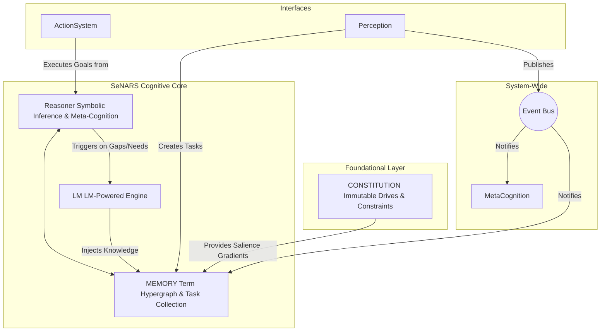

# SeNARS Cognitive System

## A Blueprint for Principled and Pragmatic Neuro-Symbolic Cognition

A complete cognitive architecture designed to achieve a synergistic union of formal symbolic reasoning and the semantic power of Large Language Models (LMs).

- Its foundation is a **Unified Knowledge Hypergraph**, a sophisticated data structure composed of immutable **`Term`s** (concepts) and stateful, evidence-backed **`Task`s** (beliefs, goals, questions).
- The system operates in a **Cycle**, a discrete reasoning loop governed by a principle of **Economic Attention**, which pragmatically prioritizes tasks based on their relevance, urgency, confidence, and predicted effort.
- All reasoning is guided by an immutable **`Constitution`** of foundational motives.
- The architecture features a dual-engine design: a symbolic **Reasoner** performs rigorous, explainable inference, while a neuro-symbolic **LM** leverages LMs for creativity, grounding, and natural language fluency.
- Through a powerful **Meta-Cognitive** feedback loop, SeNARS is designed for recursive self-improvement, creating a robust and transparent foundation for genuinely cognitive AI.

---

## Design Principles

- **Modularity and Decoupling**: Components are designed to be as independent as possible, communicating through a central `EventBus` rather than direct calls. This allows for easier maintenance, testing, and extension.
- **Explicit State Management**: All cognitive state is explicitly stored within `Task`s in the central `Memory` component. This creates a single source of truth and makes the system's state transparent and debuggable.
- **Strategy over Implementation**: For complex, multi-faceted problems like contradiction resolution and planning, the system favors a `Strategy` pattern. This allows for the dynamic selection of the best algorithm for a given context and makes it simple to add new approaches without altering core logic.
- **Meta-Cognition as a First-Class Citizen**: Self-reflection and self-improvement are not afterthoughts. The `MetaCognition` module is a core component, ensuring the system is fundamentally designed to analyze and correct its own reasoning processes.
- **Pragmatism under Scarcity**: The system assumes finite computational resources. The principle of Economic Attention, implemented via the `PriorityManager` and probabilistic `Bag` data structure, is a pragmatic solution that ensures resources are always allocated to the most salient cognitive activities.

---

## In-Depth Architecture

This section provides a detailed breakdown of the system's internal structure and mechanisms, reflecting the ideal design as implemented in the codebase.

### A. The Knowledge Core: `Term`, `Task`, and `Memory`

The system's knowledge is built upon two fundamental data structures:

- **`Term` (The Immutable Vocabulary)**: A `Term` is the unique, canonical representation of a concept (e.g., `cat`, `(cat --> animal)`).
    - **Immutability & Intelligence**: A `Term` is immutable and parses its own Narsese key upon instantiation (`src/core/Term.js`), caching its components for efficient access. This makes it a stable, reusable, and performant building block.
    - **Semantic Grounding**: Every `Term` is associated with a semantic vector embedding from the LM, grounding the symbolic representation in a high-dimensional meaning space.

- **`Task` (The Stateful Cognitive Atom)**: A `Task` represents a specific, evidence-backed cognitive act concerning a `Term` (e.g., a belief, goal, or question).
    - **Statefulness & Evidence**: A `Task` is mutable. Its state—including its `truthValue` (with `frequency` and `confidence`) and `priority`—is constantly updated by the cognitive cycle. All belief revision is handled by the dedicated `TruthValueManager` (`src/reasoner/TruthValueManager.js`), which implements the system's formal evidence calculus.
    - **Centralized Creation**: To ensure consistency, all `Task`s are created via a `TaskFactory` (`src/core/TaskFactory.js`), which centralizes validation and initialization logic.

### B. The Cognitive Engine: `Cycle`, `Reasoner`, and `PriorityManager`

The core cognitive process is driven by a loop that emulates a stream of consciousness under focused attention.

1.  **Task Selection**: The `Cycle` (`src/system/Cycle.js`) begins by asking the `Memory` for a task to process. `Memory` uses a `Bag` data structure (`src/utils/Bag.js`), a probabilistic, priority-weighted collection, to select a high-priority `Task`. This is not strictly deterministic, allowing for serendipitous discovery.
2.  **Contextual Belief Retrieval**: The selected `Task` is passed to the `Reasoner`. The `Reasoner` then queries the `Memory`'s `Term`-indexed belief map for a relevant premise, again using a priority-weighted selection to find a contextually appropriate belief.
3.  **Symbolic Inference**: The `Task` and the selected belief are processed by all applicable inference rules from the rule set in `src/reasoner/rules/`.
4.  **Evidence Revision**: The derived conclusions are processed by the `TruthValueManager`, which calculates their new truth values based on the premises.
5.  **Absorption & Prioritization**: All newly generated tasks are sent back to `Memory`. The `PriorityManager` (`src/reasoner/PriorityManager.js`) calculates their initial priority based on truth value, complexity, and relevance to active goals. The cycle then repeats.

### C. The Neuro-Symbolic Bridge: The `LM` Module

The `LM` (`src/lm/LM.js`) is not a monolithic component but a suite of specialized services that are invoked when symbolic reasoning is insufficient.

- **Pipeline Factory**: A central `PipelineFactory` (`src/lm/PipelineFactory.js`) manages the loading and caching of different transformer models from `@xenova/transformers`, ensuring efficient resource use.
- **Specialized Services**: The `LM` provides targeted functionalities, each with a specific prompt strategy and purpose:
    - `HypothesisGenerator`: For creative abduction and pattern discovery.
    - `PlanRepairer`: For suggesting alternative solutions when plans fail.
    - `ProactiveEnricher`: For expanding the knowledge graph based on new information.
    - `QAService`: For natural language interaction.

### D. The Meta-Cognitive Loop: `MetaCognition` and `ContradictionAnalyzer`

Self-correction is a core function, not an afterthought.

- **Detection**: The `MetaCognition` module (`src/system/MetaCognition.js`) is triggered by the `Cycle` to analyze newly derived tasks for contradictions against existing beliefs.
- **Strategic Resolution**: The `ContradictionAnalyzer` (`src/reasoner/ContradictionAnalyzer.js`) classifies the contradiction and selects an appropriate resolution method from the extensible set of strategies in `src/reasoner/strategies/resolution/`. This use of the Strategy Pattern means new self-correction techniques can be added without modifying the core meta-cognitive logic.
- **Corrective Task Generation**: The chosen strategy generates one or more new `Task`s (e.g., a question to gather more evidence, a goal to re-evaluate a premise) which are injected into `Memory` with high priority, directing the system's attention toward resolving the inconsistency.

### E. The Foundational Layer: The `Constitution`

The `Constitution` (`src/system/Constitution.js`) serves as the system's immutable motivational and ethical foundation. It is a pre-defined set of high-priority, permanent `Task`s that are loaded at initialization. These tasks represent fundamental drives (e.g., `AcquireKnowledge!`, `MaintainCoherence!`) and constraints (e.g., beliefs about negative outcomes). By providing a permanent source of high priority, the `Constitution` bootstraps the entire attention mechanism and ensures that the system's behavior is always anchored to its core principles.

---

## Current Implementation Status

This repository contains a working implementation of the SeNARS cognitive system as specified in the full specification.
The system includes all core components and demonstrates the key principles of neuro-symbolic cognition.

---

### 1. Core Principles (Implemented)

1. **Unified Knowledge Hypergraph**: ✅ Implemented with `Term` and `Task` classes
2. **Term/Task Distinction**: ✅ Strictly maintained in the implementation
3. **Pragmatic Economic Attention**: ✅ Priority calculation implemented
4. **Motive-Driven Cognition**: ✅ Constitution with drives and constraints
5. **Recursive Meta-Cognition**: ✅ Basic contradiction detection and analysis
6. **Neuro-Symbolic Synergy**: ✅ Integration with transformer models via LM class

---

### 2. System Architecture (Implemented)



#### 2.1 Event Bus Architecture

To enhance modularity and extensibility, the system uses a central **`EventBus`**. Components can publish events (e.g., `NewTasksCreated`) and subscribe to them, allowing for decoupled communication and making it easier to add new functionality without modifying core components.

---

### 3. Knowledge Representation (Implemented)

#### 3.1 `Term`: The Immutable Vocabulary

- **Purpose**: A unique, canonical, and *intelligent* representation of a concept or relationship.
- **Structure**:
    - `key: string`: The formal, Narsese-inspired syntax.
    - `embedding: number[]`: A dense vector representation from the `LM`.
    - `complexity: number`: A static measure of structural complexity.
- **Intelligence**: The `Term` class is not just a data container. It parses its own key upon instantiation, caching its Narsese structure. This allows for efficient access to its components (e.g., `term.subject`, `term.predicate`) as full `Term` instances, making the rest of the system's code cleaner and more performant.

#### 3.2 `Task`: The Stateful Cognitive Atom

- **Purpose**: A specific, evidence-backed statement (belief, goal, or question) about a `Term`.
- **Structure**:
    - `id: string`: Unique identifier for this specific cognitive act.
    - `termKey: string`: Foreign key pointing to a `Term`'s key.
    - `punctuation: '.' | '!' | '?'`: Belief (Judgment), Goal, or Question.
    - `state`:
        - `priority: number`: The current attentional focus score.
        - `truthValue: { frequency: number, confidence: number }`: Evidence-based belief strength.
        - `stamp: { creationTime: number, occurrenceTime?: number }`: For temporal and causal reasoning.

---

### 4. The Constitution (Implemented)

- **Purpose**: An immutable, pre-loaded set of `Task`s defining the system's foundational motivations and safety
  constraints.
- **Content**:
    - **Drives (High-Priority, Permanent Goals)**:
        - `AcquireKnowledge!`
        - `ReduceUncertainty!`
        - `MaintainCoherence!` (Resolve contradictions)
        - **`MaintainCognitiveIntegrity!`**: The core meta-cognitive drive for self-improvement.
    - **Constraints (High-Confidence Beliefs about Negative Outcomes)**:
        - `((&, self, cause_harm) ==> NEGATIVE_OUTCOME).`

---

### 5. The Cycle (Core Loop) (Implemented)

The cognitive cycle is implemented in `src/system/Cycle.js` and follows the specification:

1. **Perception**: Ingest new information from the world (implemented in `src/system/Perception.js`).
2. **Prioritization**: Apply economic attention to all tasks.
3. **Inference**: Reason upon the most salient tasks.
4. **Meta-Cognition**: Detect and analyze reasoning failures.
5. **Semantic Enrichment & Action**: Process new terms and execute goals.

---

### 6. Core Mechanisms (Partially Implemented)

#### 6.1 Dynamic Priority Calculation (Economic Attention)

✅ Implemented in `src/system/Cycle.js`

#### 6.2 Reasoner & Meta-Cognition

✅ Basic inference rules (deduction, induction, abduction, analogy) implemented in `src/reasoner/`
✅ Basic contradiction detection in `src/system/MetaCognition.js`

#### 6.3 The LM (Neuro-Symbolic Engine)

✅ Integration with transformer models via ` @xenova/transformers` in `src/lm/LM.js`
✅ Term embedding generation implemented

---

## Development Roadmap

### Track 1: Core Cognition & Self-Improvement

- **Short-Term (1-3 Months): Self-Tuning Planner & Inference Prioritization.**
    - **Action 1:** Implement a meta-cognitive feedback loop for the A\* planner to automatically adjust its heuristic weights based on plan success/failure rates.
    - **Action 2:** Develop a lightweight model that predicts the most promising inference rule(s) to apply based on the current task, pruning the search space for greater efficiency.
    - **Benefit:** A more adaptive and computationally efficient reasoning core.

- **Mid-Term (3-9 Months): Principled Goal Refinement & Cognitive Sandboxing.**
    - **Action 1:** Develop the capacity to analyze a user-provided goal's implications for consistency with the `Constitution`. The system will use the LM to propose refined goals that achieve the user's intent while respecting constitutional constraints.
    - **Action 2:** Implement a "Cognitive Sandbox" environment where the system can simulate the likely outcomes of a plan or a change to its own configuration before committing to it.
    - **Benefit:** A crucial step towards safe and aligned AI, ensuring the system is not just capable but also principled and cautious.

- **Long-Term (9+ Months): Auditable Constitution Evolution.**
    - **Action:** Develop a secure mechanism where the system can, based on extensive analysis of reasoning failures and successes within its sandbox, generate a formal "change proposal" for its own `Constitution`. This proposal would include the suggested change, the reasoning behind it, and a battery of simulated outcomes, all presented to a human operator for final, auditable approval.
    - **Benefit:** The highest level of cognitive plasticity: the ability for the system to safely and transparently adapt its own fundamental values.
    - **Key Question:** How can the system propose meaningful changes to its own values without succumbing to instrumental drift or generating trivial suggestions?

### Track 2: Knowledge Architecture & Scalability

- **Short-Term (1-3 Months): Semantic Knowledge Index.**
    - **Action:** Implement a vector database (e.g., FAISS, Chroma) for storing and retrieving `Term` embeddings to replace linear searches.
    - **Benefit:** Massively accelerates semantic similarity checks, making LM integration and analogy-based reasoning scalable.

- **Mid-Term (3-9 Months): Hybrid Memory & Cognitive Delegation.**
    - **Action 1:** Architect a hybrid memory system with a high-speed in-memory cache for active tasks and a persistent, disk-based graph database for long-term knowledge.
    - **Action 2:** Develop a "Cognitive Delegation Protocol" allowing a primary SeNARS instance to offload specialized cognitive tasks (e.g., complex planning, deep causal analysis) to other instances with specific expertise.
    - **Benefit:** Enables both long-term memory persistence and the formation of a "society of minds" that can achieve a higher level of collective intelligence.

- **Long-Term (9+ Months): Dynamic Knowledge Graph Federation.**
    - **Action:** Design a protocol for the distributed cognitive network to dynamically link and synchronize their knowledge graphs. This will include developing consensus mechanisms and belief reconciliation strategies to resolve conflicts between agents' beliefs.
    - **Benefit:** The creation of a persistent, decentralized, and self-organizing collective intelligence.
    - **Key Question:** What is the optimal consensus mechanism for a network of evidence-based reasoners with differing experiences and confidence levels?

### Track 3: Cognitive Tooling & Autonomous Development

- **Short-Term (1-3 Months): Interactive Cognitive Visualizer.**
    - **Action:** Develop a web-based front-end that connects to a running SeNARS instance and visualizes the knowledge graph, task priorities, and reasoning traces in real-time.
    - **Benefit:** Makes the system's internal state transparent and dramatically accelerates debugging and analysis.

- **Mid-Term (3-9 Months): Self-Diagnosis of Test Failures.**
    - **Action:** Create a workflow where unit test failures are fed into the `Perception` module. The system will be given knowledge of its own source code structure and a goal to find the cause of the failure. It will use its reasoning and LM capabilities to hypothesize the location of the bug.
    - **Benefit:** The first step in leveraging the system to accelerate its own development, reducing debugging time.

- **Long-Term (9+ Months): The Cognitive App Store & Self-Documentation.**
    - **Action 1:** Develop a highly robust Cognitive Extensibility API and a corresponding packaging format. This would allow third parties (or the AI itself) to create, share, and dynamically load "cognitive modules"—new inference rules, resolution strategies, or even entire specialized cognitive engines.
    - **Action 2:** Task the system with generating its own documentation. By tracing its own reasoning paths and using the XAI module, it will write developer-focused markdown files explaining the functionality of its own components.
    - **Benefit:** Transforms the project into a truly extensible platform and creates a powerful feedback loop where the system improves its own maintainability.

### Track 4: Symbiotic Intelligence & Interfaces

- **Short-Term (1-3 Months): Explainable AI (XAI) Narratives.**
    - **Action:** Implement a module that can trace the derivation history of any given `Task` and use the LM to translate that formal, symbolic chain of reasoning into a clear and concise natural language explanation.
    - **Benefit:** Answers the question "Why do you believe that?" in a way that is both truthful to the underlying logic and understandable to a human user.

- **Mid-Term (3-9 Months): Mixed-Initiative Collaborative Reasoning.**
    - **Action:** Develop the capability for the system to engage in a true dialogue to solve a problem. This includes building a "User Intent Model" to track the user's likely goals and fluidly switching between taking instructions, asking clarifying questions, and proactively offering suggestions.
    - **Benefit:** Moves beyond simple Q&A to a genuine partnership model, where the human and AI work together to find a solution.

- **Long-Term (9+ Months): Proactive Cognitive Augmentation.**
    - **Action:** The system will maintain and update its model of the user's context and goals. It will use this model to proactively fetch relevant information, identify potential flaws or biases in the user's stated plans, and offer suggestions and insights *before* being explicitly asked.
    - **Benefit:** The ultimate vision of a cognitive partner: an AI that acts as a true extension and enhancement of the user's own mind.
    - **Key Question:** How can the system provide proactive assistance without becoming intrusive or making incorrect assumptions about the user's intent?

---

## Getting Started

### Prerequisites

- Node.js (v14 or higher)
- npm

### Installation

```bash
npm install
```

### Running the Interactive Demo Runner

To explore the system's capabilities, use the interactive demo runner:

```bash
npm run start:demo
```

This command will present you with a list of available demos. You can choose to run a specific demo or all of them sequentially. This is the best way to see the system in action.

### Running Tests

```bash
npm test
```

---

## Usage as a Library

You can easily integrate the SeNARS system into your own projects.

```javascript
const { System } = require('./src'); // Assuming you have an index.js in src
const { Task } = require('./src/core/Task');
const { parseTerm } = require('./src/parser/narseseParser');

async function runSystem() {
    // 1. Initialize the system
    const system = new System();
    await system.initialize();

    // 2. Add knowledge to the system
    const belief = new Task(
        parseTerm('<cat --> animal>.'),
        '.',
        { frequency: 1.0, confidence: 0.9 }
    );
    await system.addTasks([belief]);

    console.log('System initialized and belief added.');

    // 3. Run the cognitive cycle
    for (let i = 0; i < 10; i++) {
        const output = await system.runCycle();
        console.log(`Cycle ${i+1} complete. Derived ${output.derivedTasks} new tasks.`);
    }

    system.stop();
}

runSystem();
```

---

## Contributing

We welcome contributions from the community! To contribute, please follow these guidelines:

1.  **Fork the repository.**
2.  **Create a new branch** for your feature or bug fix.
3.  **Follow the coding style:** Adhere to the principles outlined in `AGENTS.md`. The code should be clean, self-documenting, and elegant.
4.  **Write tests** for any new functionality.
5.  **Submit a pull request** with a clear description of your changes.

### Project Structure

```
senars8/
├── src/
│   ├── core/          # Core classes (Term, Task, TaskFactory)
│   ├── memory/        # Memory management (Memory)
│   ├── parser/        # Narsese lexer and parser
│   ├── reasoner/      # Inference engine and strategies
│   ├── lm/            # Language model integration
│   ├── system/        # High-level system components (System, Cycle, etc.)
│   └── utils/         # Utility functions
├── demos/             # Demonstration scripts (including interactive-runner.js)
├── tests/             # Test suite
├── package.json       # Project dependencies
└── README.md          # This file
```

---

## Features

- **Symbolic Reasoning**: Formal inference with deduction, induction, abduction, and analogy
- **Neuro-Symbolic Integration**: Embedding-based semantic similarity and term grounding
- **Attention Mechanism**: Economic attention model for task prioritization
- **Meta-Cognition**: Contradiction detection with an extensible, strategy-pattern-based resolution system.
- **Planning**: A sophisticated, graph-integrated Hierarchical Task Network (HTN) planner that decomposes complex goals by querying planning knowledge stored directly in the knowledge graph.
- **Temporal Reasoning**: Time-aware task processing

---

## Demos

1. **Math Inference Demo**: Tests logical inference with mathematical relationships
2. **Planning Demo**: Demonstrates goal-directed behavior and planning
3. **Comprehensive System Demo**: Full system demonstration with complex knowledge
4. **NLP Integration Demo**: Shows natural language processing capabilities
5. **Contradiction Resolution Demo**: Demonstrates meta-cognitive capabilities

---

## Future Work

- Enhanced meta-cognition with more sophisticated contradiction resolution
- Advanced LM capabilities (hypothesis generation, explanation)
- More complex perception interfaces
- Extended action execution system
- Improved temporal reasoning capabilities
