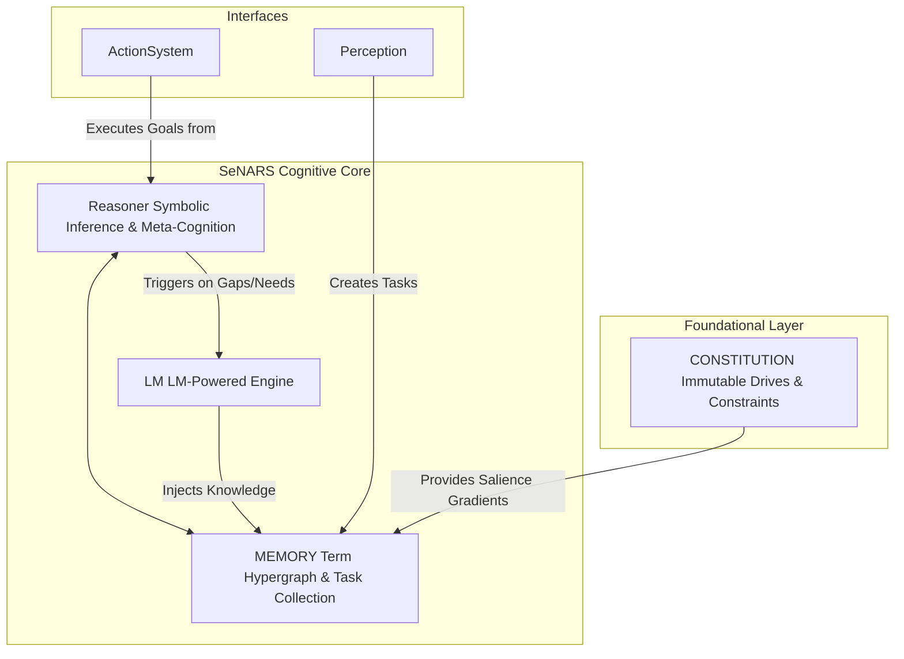

<!-- _class: invert -->
<!-- _header: 'SeNARS: Cutting-Edge Documentation for Tech Innovation 🚀' -->

# **SeNARS Cognitive System**

A Blueprint for Principled and Pragmatic Neuro-Symbolic Cognition

---

## **System Overview & Purpose** 📋

SeNARS is a complete cognitive architecture designed for a synergistic union of **formal symbolic reasoning** and the semantic power of **Large Language Models (LMs)**.

- **Unified Knowledge Hypergraph**: A sophisticated data structure of immutable `Term`s (concepts) and stateful `Task`s (beliefs, goals).
- **Economic Attention**: A core principle that pragmatically prioritizes tasks based on relevance, urgency, and confidence.
- **Dual-Engine Design**: A symbolic **Reasoner** for rigorous inference and a neuro-symbolic **LM** for creativity and grounding.
- **Meta-Cognitive Loop**: A powerful feedback mechanism for recursive self-improvement and robust, transparent cognition.

---

## **Our Key Innovations** ✨

Three breakthroughs that define the SeNARS architecture:

1.  **Economic Attention**: A pragmatic attention mechanism that focuses computational resources like a stream of consciousness, ensuring **efficiency at scale**.
2.  **Principled Neuro-Symbolic Synergy**: A dual-engine design where a formal **Reasoner** provides logic and an **LM** provides creativity. **Not a black box, but a true synergy**.
3.  **Recursive Meta-Cognition**: The ability to reason about its own reasoning. SeNARS can detect contradictions, analyze its failures, and **self-correct for robust, continuous learning**.

---

## **Research History: A Journey of Innovation** 🕰️

From a foundational blueprint to a powerful cognitive engine, SeNARS evolved through key architectural breakthroughs.

- **Phase 1: Principled Foundation**: Established core design principles: **Modularity**, **Explicit State**, and the **Strategy Pattern**.
- **Phase 2: The Symbolic Core**: Developed the robust symbolic reasoner, the `Term`/`Task` knowledge representation, and the main `Cycle` loop.
- **Phase 3: The Economic Attention Breakthrough**: Implemented the **Economic Attention** model, enabling pragmatic, resource-aware focus.
- **Phase 4: The Neuro-Symbolic Bridge**: Integrated LMs not as a black box, but as a suite of specialized, auditable services.
- **Phase 5: Enabling Meta-Cognition**: Introduced the self-correction loop, allowing the system to detect and resolve its own internal contradictions.

---

## **Computer Science Breakthroughs** 💡

SeNARS introduces several groundbreaking implications for computer science:

- 📈 **Scalability**: The **Unified Knowledge Hypergraph** and planned vector database integration enable massive scalability.
- ⚡ **Efficiency**: The **Economic Attention** model ensures optimal use of computational resources, mimicking focused consciousness.
- 🤖 **Novel Algorithms**: A hybrid reasoning model that combines the strengths of logical inference and neural intuition.
- 🔄 **Recursive Self-Improvement**: The **Meta-Cognitive** loop provides a framework for genuine AI learning and adaptation.

---

## **System Design (Comprehensive)** 🛠️

### **High-Level Architecture**

---

## **System Design: The Knowledge Core** 🧠

The foundation of SeNARS is a transparent and stable knowledge hypergraph.

- **`Term` (The Immutable Vocabulary)**: A unique, canonical representation of a concept (e.g., `cat`). They are **immutable and intelligent**, parsing their own structure for maximum efficiency.
- **`Task` (The Stateful Cognitive Atom)**: A specific, evidence-backed belief, goal, or question about a `Term`. Its state—including `truthValue` and `priority`—is constantly updated by the reasoning process.

This clean separation is key to the system's **stability and transparency**.

---

## **System Design: The Cognitive Engine** ⚙️

The system operates in a **`Cycle`**, a discrete reasoning loop that mimics a stream of consciousness under focused attention.

1.  **Task Selection**: A high-priority `Task` is probabilistically selected from memory.
2.  **Contextual Inference**: The `Reasoner` fetches a relevant belief and applies formal inference rules (deduction, induction, etc.).
3.  **Evidence & Priority Update**: New conclusions are assigned an evidence-based `truthValue` and a new `priority` score.

The entire process is governed by **Economic Attention**, pragmatically allocating computational resources to the most salient tasks.

---

## **System Design: The Neuro-Symbolic Bridge** 🌉

SeNARS integrates LMs as a suite of specialized services, not a black box.

- The **`LM` module** is invoked when symbolic reasoning is insufficient, providing:
    - **`HypothesisGenerator`**: For creative abduction and pattern discovery.
    - **`PlanRepairer`**: For suggesting novel solutions when plans fail.
    - **`ProactiveEnricher`**: For expanding the knowledge graph based on new info.
    - **`QAService`**: For fluent natural language interaction.

This creates a powerful synergy: the **Reasoner** provides rigor, while the **LM** provides creativity and grounding.

---

## **System Design: The Meta-Cognitive Loop** 🔄

SeNARS is designed for **recursive self-improvement**. It doesn't just reason—it reasons about its own reasoning.

1.  **Detection**: The `MetaCognition` module constantly scans for contradictions between new conclusions and existing beliefs.
2.  **Analysis**: The `ContradictionAnalyzer` classifies the conflict and selects the best resolution `Strategy`.
3.  **Correction**: A new `Task` (e.g., a `Question` to gather evidence) is generated with high priority, focusing the system's attention on resolving the inconsistency.

---

## **System Design: The Foundational Layer** 🏛️

The **`Constitution`** is an immutable set of pre-loaded `Task`s that define the system's core motives and safety constraints.

- **Drives**: High-priority, permanent goals like `AcquireKnowledge!` and `MaintainCoherence!`.
- **Constraints**: High-confidence beliefs about undesirable outcomes to ensure safe operation.

The `Constitution` bootstraps the attention mechanism and ensures the system's behavior is **always anchored to its foundational principles**.

---

## **A Survey of Application Domains** 🌍

The flexibility of the SeNARS architecture makes it suitable for a wide array of domains:

- 🔬 **Scientific Discovery**: Assisting researchers by generating hypotheses, interpreting data, and suggesting new experiments.
- 🤖 **Intelligent Automation**: Creating robust systems that can automate complex processes and adapt to changing conditions.
- 🎓 **Personalized Learning**: Building adaptive educational tools that tailor curricula to individual student needs and learning styles.
- 🛡️ **Safe & Verifiable AI**: Providing a foundation for building systems where safety and ethical alignment can be formally verified.
- 🤝 **Human-AI Collaboration**: Developing tools that act as true cognitive partners, augmenting human intellect.

---

## **High-Impact Commercial Applications** 💰

SeNARS is not just a research project; it's an engine for market-ready solutions.

- **De-Risk AI in Regulated Industries**: Deliver fully auditable, explainable AI (XAI) for finance & healthcare, unlocking new markets.
- **10x R&D Acceleration**: Empower labs with autonomous systems that design experiments, analyze data, and uncover novel insights.
- **Next-Gen Cognitive Automation**: Go beyond brittle scripts. Build resilient automation that can reason, adapt, and self-correct its own workflows.
- **Revolutionize EdTech & Training**: Create truly adaptive learning platforms that model a user's knowledge to maximize outcomes.
- **Platform for Safe, Aligned AI**: Provide the foundational architecture for building AI partners that can rigorously adhere to complex ethical constraints.

---

## **Research Agenda** 🔍

Our innovation roadmap is focused on creating a recursively self-improving and scalable cognitive architecture.

- 🧠 **Track 1: Core Cognition & Self-Improvement**: Develop self-tuning planners and principled goal refinement.
- 🏗️ **Track 2: Knowledge Architecture & Scalability**: Implement a vector database and a hybrid memory system.
- 🛠️ **Track 3: Cognitive Tooling & Autonomous Development**: Build an interactive cognitive visualizer and enable self-diagnosis.
- 🤝 **Track 4: Symbiotic Intelligence & Interfaces**: Create mixed-initiative reasoning systems and proactive cognitive augmentation.

---

## **Investor-Ready Highlights** 💰

SeNARS is designed from the ground up to deliver value and attract investment.

- 📈 **Built to Scale**: A clear architectural path to handle enterprise-level workloads.
- 💰 **High-Value Markets**: Targeting lucrative opportunities in XAI, Cognitive Automation, and Safe AI.
- 👨‍💻 **Attracts Top Talent**: A clean, modular, and well-documented design that developers love.
- 📊 **Clear Path to ROI**: A research agenda focused on delivering commercial value at every step.

---

<!-- _class: invert -->

## **Thank You**

### Questions?
