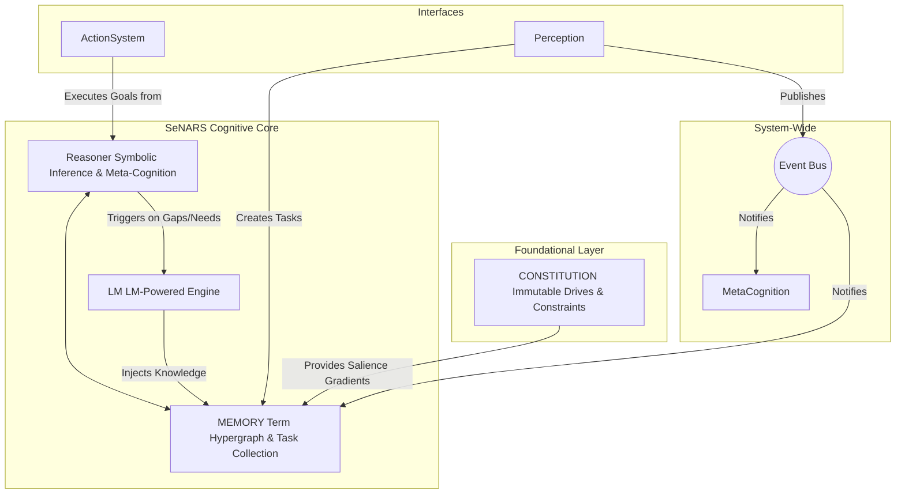

<!--
This Markdown file is formatted for use with Marp.
To view it as a presentation, install the Marp for VS Code extension.
You can then export it to a high-quality PDF.
-->

# **SeNARS Cognitive System** 🧠

### A Blueprint for Principled and Pragmatic Neuro-Symbolic Cognition

---

## **System Overview** 🎯

*   **Purpose**: To build a "thinking machine" that can learn and reason like a human.
*   **Core Idea**: It adapts to its environment, even with incomplete information. 🧐
*   **Key Feature**: A unique blend of symbolic logic and the power of Large Language Models (LMs).

---

## **A Brief History of NARS** 📜

*   **NARS**: Non-Axiomatic Reasoning System.
*   **Pioneered by**: Dr. Pei Wang.
*   **Radical Idea**: A system that works with *insufficient* knowledge and resources, unlike traditional logic systems.
*   **Foundation**: It learns from experience and revises its beliefs.

---

## **From NARS to SeNARS** ✨

*   **SeNARS** extends the core principles of NARS.
*   **The Big Upgrade**: It integrates Large Language Models (LMs) for enhanced capabilities:
    *   Creativity 💡
    *   Semantic understanding 🌍
    *   Natural language fluency 🗣️

---

## **Core Design Principles** 🏗️

*   **Modular**: Components are independent and communicate via an `EventBus`.
*   **Explicit State**: All knowledge is stored centrally in `Memory`.
*   **Strategy Pattern**: Flexible algorithms for complex problems (e.g., planning).
*   **Meta-Cognition**: The system can reflect on and correct its own reasoning. 🤔
*   **Pragmatism**: It focuses on the most important tasks, assuming limited resources.

---

## **System Architecture** 🗺️



---

## **The Knowledge Core** 🧱

*   **`Term`**: An immutable concept (e.g., `cat`).
*   **`Task`**: A piece of knowledge about a `Term` (e.g., a belief, goal, or question). 📝
    *   Has a `truthValue` (how much to believe it) and a `priority`.
*   **`Memory`**: A hypergraph of all `Terms` and `Tasks`.

---

## **The Cognitive Engine** ⚙️

*   **`Cycle`**: The main reasoning loop, like a stream of consciousness.
    1.  Selects a high-priority `Task` from `Memory`.
    2.  Retrieves a relevant belief.
    3.  Applies inference rules to derive new knowledge.
*   **`Reasoner`**: The symbolic engine that performs logical inference.

---

## **The Neuro-Symbolic Bridge** 🌉

*   The **`LM`** module is a suite of specialized services.
*   It's used when symbolic reasoning isn't enough:
    *   `HypothesisGenerator`: For creative ideas.
    *   `PlanRepairer`: To fix failing plans.
    *   `QAService`: For natural language questions.

---

## **Meta-Cognition & The Constitution** 🧭

*   **`MetaCognition`**: The system's ability to analyze its own reasoning.
    *   It detects contradictions and triggers self-correction.
*   **`Constitution`**: A set of core, unchangeable goals and values.
    *   Examples: `AcquireKnowledge!`, `MaintainCoherence!`.
    *   Ensures the system's behavior is always anchored to its principles.

---

## **Breakthroughs & Implications** 🚀

*   **Unified Cognition**: A single system for learning, reasoning, and planning.
*   **Reasoning Under Uncertainty**: Handles real-world ambiguity gracefully.
*   **Transparent & Explainable**: Can explain *why* it believes something.
*   **Safe AI**: The `Constitution` provides a foundation for aligned and principled AI.

---

## **Real-World Applications** 🤖

*   **Autonomous Agents & Robotics**: For planning and decision-making in complex environments.
*   **Knowledge Management**: Building and reasoning over large knowledge bases.
*   **Collaborative Reasoning**: Acting as a partner to help users solve problems.
*   **Autonomous Development**: The system can even help debug and document itself! 🤯

---

## **The Road Ahead** 🛣️

*   The project has a detailed development roadmap with several tracks.
*   **Goal**: To continuously improve the system's cognitive abilities and scalability.

---

## **Research Tracks** 🔬

*   **Core Cognition**: Improving planning and inference.
*   **Knowledge Architecture**: Scaling memory and knowledge.
*   **Cognitive Tooling**: Building tools to visualize and debug the system.
*   **Symbiotic Intelligence**: Creating a true partnership between humans and AI.

---

## **Getting Started** 💻

*   **Prerequisites**: Node.js and npm.
*   **Installation**:
    ```bash
    npm install
    ```
*   **Run Demos**:
    ```bash
    npm run start:demo
    ```

---

## **Thank You!** 🙏

### Questions?
