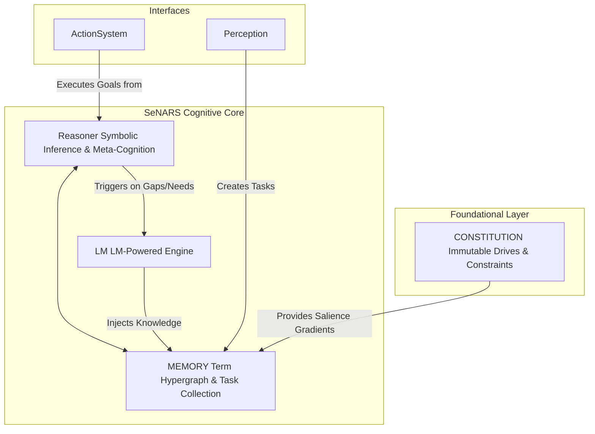

<!-- _class: invert -->
<!-- _header: 'SeNARS: Cutting-Edge Documentation for Tech Innovation 🚀' -->

# **SeNARS Cognitive System**

A Blueprint for Principled and Pragmatic Neuro-Symbolic Cognition

---

## **System Overview & Purpose** 📋

SeNARS is a complete cognitive architecture designed for a synergistic union of **formal symbolic reasoning** and the semantic power of **Large Language Models (LMs)**.

- **Unified Knowledge Hypergraph**: A sophisticated data structure of immutable `Term`s (concepts) and stateful `Task`s (beliefs, goals).
- **Economic Attention**: A core principle that pragmatically prioritizes tasks based on relevance, urgency, and confidence.
- **Dual-Engine Design**: A symbolic **Reasoner** for rigorous inference and a neuro-symbolic **LM** for creativity and grounding.
- **Meta-Cognitive Loop**: A powerful feedback mechanism for recursive self-improvement and robust, transparent cognition.

---

## **Research History (Brief)** 🕰️

*(This section is a placeholder and can be populated with key milestones and pivotal moments in the project's evolution.)*

- **Conceptualization**: Initial whitepaper and system design.
- **Prototype Development**: Core components and reasoning engine.
- **LM Integration**: Bridging symbolic and neural networks.
- **Open Source Release**: Community engagement and collaboration.

---

## **Computer Science Breakthroughs** 💡

SeNARS introduces several groundbreaking implications for computer science:

- **Scalability**: The **Unified Knowledge Hypergraph** and planned vector database integration enable massive scalability.
- **Efficiency**: The **Economic Attention** model ensures optimal use of computational resources, mimicking focused consciousness.
- **Novel Algorithms**: A hybrid reasoning model that combines the strengths of logical inference and neural intuition.
- **Recursive Self-Improvement**: The **Meta-Cognitive** loop provides a framework for genuine AI learning and adaptation.

---

## **System Design (Comprehensive)** 🛠️

### **High-Level Architecture**

---

## **System Design: Neuro-Symbolic Integration** 🧠

The core innovation of SeNARS is its seamless integration of a symbolic **Reasoner** and a neural **LM**.

- **Symbolic Core**: The Reasoner performs rigorous, explainable inference using formal logic (deduction, induction, abduction).
- **Neuro-Symbolic Bridge**: The `LM` module is not a monolith but a suite of specialized services for tasks where symbolic logic falls short:
    - **`HypothesisGenerator`**: For creative pattern discovery.
    - **`PlanRepairer`**: For suggesting novel solutions to failed plans.
    - **`ProactiveEnricher`**: For expanding the knowledge graph with contextual information.
    - **`QAService`**: For fluent natural language interaction.

This dual-engine design creates a system that is both **principled and pragmatic**.

---

## **Real-World Applications** 🌍

The SeNARS architecture unlocks a wide range of high-impact, market-ready solutions:

- **Explainable AI (XAI) as a Service**: Generate clear, natural language explanations for complex decisions.
- **Autonomous Scientific Research**: Hypothesize, experiment, and analyze data in scientific domains.
- **Cognitive Automation**: Build systems that can reason about and self-correct their own workflows.
- **Personalized Education**: Create adaptive learning platforms that model a user's knowledge and intent.
- **Safe & Aligned AI**: Develop AI partners that can reason about and adhere to ethical constraints.

---

## **Research Agenda** 🔍

Our innovation roadmap is focused on creating a recursively self-improving and scalable cognitive architecture.

- **Track 1: Core Cognition & Self-Improvement**: Develop self-tuning planners and principled goal refinement.
- **Track 2: Knowledge Architecture & Scalability**: Implement a vector database and a hybrid memory system for long-term knowledge persistence.
- **Track 3: Cognitive Tooling & Autonomous Development**: Build an interactive cognitive visualizer and enable self-diagnosis of test failures.
- **Track 4: Symbiotic Intelligence & Interfaces**: Create mixed-initiative reasoning systems and proactive cognitive augmentation.

---

## **Investor-Ready Highlights** 💰

SeNARS is designed to attract engineering talent and deliver significant ROI.

- **Scalability Focus**: A clear path to a massively scalable knowledge architecture.
- **Commercial Potential**: High-value applications in XAI, automation, and safe AI.
- **Developer-Friendly**: A modular, decoupled design with a focus on self-documentation.
- **Clear ROI**: The research agenda prioritizes features that enhance system autonomy, safety, and commercial viability.

---

<!-- _class: invert -->

## **Thank You**

### Questions?
