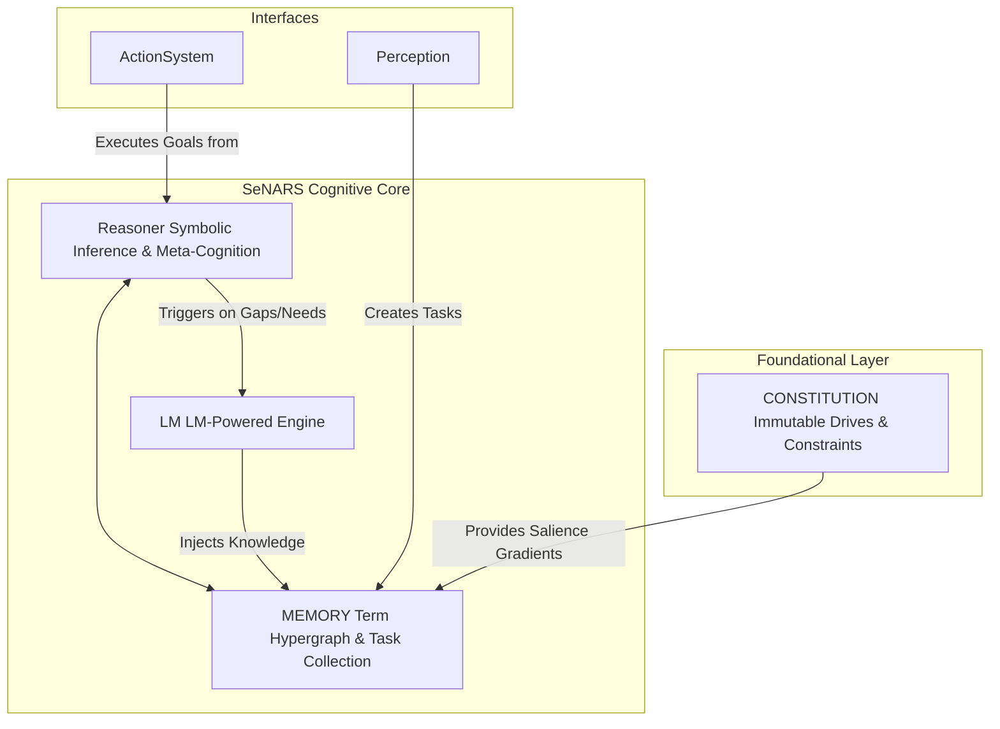

<!-- _class: invert -->
<!-- _header: 'SeNARS: Cutting-Edge Documentation for Tech Innovation 🚀' -->

# **SeNARS Cognitive System**

Principled and Pragmatic Neuro-Symbolic Cognition

---

## **The "Black Box" Problem** 📦

Today's powerful AI models are often **opaque**, **unpredictable**, and **brittle**.

- 🤔 **Lack of Explainability**: "Why did it do that?" is a question most AI can't answer. This is a non-starter for
  mission-critical applications.
- 📉 **Instability & Unreliability**: Minor changes in input can cause catastrophic, nonsensical failures.
- 🧩 **Poor Abstract Reasoning**: They struggle with formal logic, causality, and long-term planning.

This creates a **massive barrier** to deploying AI in high-value, regulated industries.

---

## **What is Neuro-Symbolic AI?** 🧠

Neuro-symbolic AI combines the best of both worlds:

- **Neural Networks**: Excellent at pattern recognition, handling uncertainty, and processing unstructured data
- **Symbolic AI**: Strong at logical reasoning, knowledge representation, and explainability

The integration creates systems that are:
- More interpretable than pure neural approaches
- More flexible than purely symbolic systems
- Better at generalizing from limited examples
- Capable of both intuitive and logical reasoning

---

## **The Solution: A Transparent, Reasoning Mind** 💡

SeNARS is a **neuro-symbolic** architecture that delivers **explainable, robust, and adaptive AI**.

- **Best of Both Worlds**: We combine a **Symbolic Reasoner** for logic and auditability with an **LM** for intuition
  and creativity.
- **Fully Explainable (XAI)**: Trace every conclusion back to its premises. No black boxes.
- **Designed for Safety**: An immutable `Constitution` ensures alignment with core principles.
- **Robust & Adaptive**: Reasons about its own failures and self-corrects, enabling continuous learning.

**SeNARS is built for the high-stakes applications where trust is non-negotiable.**

---

## **A Multi-Billion Dollar Opportunity** 📈

Explainable AI (XAI) is not a niche—it's the key to unlocking the highest-value markets where trust and auditability are
paramount.

- **Financial Services ($10B+)**: Algorithmic trading, credit scoring, and compliance monitoring.
- **Healthcare & Life Sciences ($15B+)**: Medical diagnosis, drug discovery, and personalized medicine.
- **Autonomous Systems ($20B+)**: Self-driving vehicles, robotics, and industrial automation.

**SeNARS is uniquely positioned to capture these markets where standard "black-box" solutions are too risky.**

---

## **Our Competitive Edge** 🎯

| Feature            |  Pure LLMs (e.g., GPT-4)  | Traditional Symbolic AI  |          **SeNARS**          |
|:-------------------|:-------------------------:|:------------------------:|:----------------------------:|
| **Explainability** |          ⬛️ Low           |          ✅ High          |          ✅ **High**          |
| **Adaptability**   |         🟨 Medium         |          ⬛️ Low          |          ✅ **High**          |
| **Creativity**     |          ✅ High           |          ⬛️ Low          |          ✅ **High**          |
| **Logical Rigor**  |         🟨 Medium         |          ✅ High          |          ✅ **High**          |
| **Verdict**        | ✨ Creative but Unreliable | 🧱 Rigid but Explainable | ✅ **Transparent & Powerful** |

---

## **System Overview & Purpose** 📋

SeNARS is a complete cognitive architecture designed for a synergistic union of **formal symbolic reasoning** and the
semantic power of **Large Language Models (LMs)**.

- **Unified Knowledge Hypergraph**: A sophisticated data structure of immutable `Term`s (concepts) and stateful `Task`
  s (beliefs, goals).
- **Economic Attention**: A core principle that pragmatically prioritizes tasks based on relevance, urgency, and
  confidence.
- **Dual-Engine Design**: A symbolic **Reasoner** for rigorous inference and a neuro-symbolic **LM** for creativity and
  grounding.
- **Meta-Cognitive Loop**: A powerful feedback mechanism for recursive self-improvement and robust, transparent
  cognition.

---

## **Our Key Innovations** ✨

Three breakthroughs that define the SeNARS architecture:

1. **Economic Attention**: A pragmatic attention mechanism that focuses computational resources like a stream of
   consciousness, ensuring **efficiency at scale**.
2. **Principled Neuro-Symbolic Synergy**: A dual-engine design where a formal **Reasoner** provides logic and an **LM**
   provides creativity. **Not a black box, but a true synergy**.
3. **Recursive Meta-Cognition**: The ability to reason about its own reasoning. SeNARS can detect contradictions,
   analyze its failures, and **self-correct for robust, continuous learning**.

---

## **Core Components: Foundation of SeNARS** 🧱

SeNARS is built on three fundamental components:

- **`Term`**: Immutable representations of concepts (e.g., `cat`, `(cat --> animal)`)
  - Parses their own structure for efficiency
  - Grounded with semantic embeddings from LMs
  - Serve as the stable vocabulary of the system

- **`Task`**: Stateful cognitive atoms representing beliefs, goals, or questions about Terms
  - Contain truth values (frequency, confidence)
  - Have dynamic priorities for attention allocation
  - Are temporal with creation and occurrence timestamps

- **`Memory`**: Unified knowledge hypergraph managing Terms and Tasks
  - Implements short-term and long-term storage
  - Uses specialized indexes for efficient retrieval
  - Applies forgetting mechanisms to manage resources

---

## **Research History: A Journey of Innovation** 🕰️

From a foundational blueprint to a powerful cognitive engine, SeNARS evolved through key architectural breakthroughs.

- **Phase 1: Principled Foundation**: Established core design principles: **Modularity**, **Explicit State**, and the *
  *Strategy Pattern**.
- **Phase 2: The Symbolic Core**: Developed the robust symbolic reasoner, the `Term`/`Task` knowledge representation,
  and the main `Cycle` loop.
- **Phase 3: The Economic Attention Breakthrough**: Implemented the **Economic Attention** model, enabling pragmatic,
  resource-aware focus.
- **Phase 4: The Neuro-Symbolic Bridge**: Integrated LMs not as a black box, but as a suite of specialized, auditable
  services.
- **Phase 5: Enabling Meta-Cognition**: Introduced the self-correction loop, allowing the system to detect and resolve
  its own internal contradictions.

---

## **Computer Science Breakthroughs** 💡

SeNARS introduces several groundbreaking implications for computer science:

- 📈 **Scalability**: The **Unified Knowledge Hypergraph** and planned vector database integration enable massive
  scalability.
- ⚡ **Efficiency**: The **Economic Attention** model ensures optimal use of computational resources, mimicking focused
  consciousness.
- 🤖 **Novel Algorithms**: A hybrid reasoning model that combines the strengths of logical inference and neural
  intuition.
- 🔄 **Recursive Self-Improvement**: The **Meta-Cognitive** loop provides a framework for genuine AI learning and
  adaptation.

---

## **How It Works: A Simple Analogy** 🧠

Think of SeNARS as a **digital brain** designed for trust and transparency.

It has two parts working in perfect synergy:

1. **The Logical "Conscious Mind" (The Reasoner)**
    - Handles formal, step-by-step reasoning. It's analytical, auditable, and ensures every decision can be fully
      explained.

2. **The Creative "Subconscious" (The LM)**
    - Provides intuition, semantic understanding, and creative hypotheses. It's the source of novel ideas and fluent
      language.

A **Meta-Cognitive Loop** acts as the brain's self-awareness, constantly checking for errors and improving its own
thinking over time.

---

## **The Cognitive Cycle: Stream of Consciousness** 🔁

SeNARS operates in discrete cognitive cycles that emulate a stream of consciousness:

1. **Perception**: Ingest new information from the world
2. **Prioritization**: Apply economic attention to all tasks
3. **Meta-Cognition**: Detect and analyze reasoning failures
4. **Reasoning**: Perform inference on salient tasks
5. **Enrichment**: Process new terms and execute goals

Each cycle is a complete reasoning loop, ensuring continuous learning and adaptation.

---

## **System Design (Comprehensive)** 🛠️

### **High-Level Architecture**

---

## **Event-Driven Architecture** 📡

SeNARS uses a central **`EventBus`** for decoupled communication:

- **Components** publish events (e.g., `NewTasksCreated`)
- **Components** subscribe to events they care about
- Enables modular design without direct dependencies
- Makes it easier to add new functionality without modifying core components

This architecture enhances modularity and extensibility throughout the system.

---

## **Memory Management** 💾

SeNARS implements a dual memory system for efficient knowledge management:

### **Short-term Memory**
- Active tasks prioritized for immediate processing
- Probabilistic selection of high-priority tasks
- Time-based pruning of expired, unimportant tasks

### **Long-term Memory**
- Consolidated tasks with high importance or confidence
- Automatic transfer from short-term when importance thresholds are met
- Persistent storage for accumulated knowledge

### **Indexing Systems**
- **Belief Index**: Tasks indexed by term keys for efficient retrieval
- **Implication Index**: Planning knowledge for rapid access during planning
- **Cost Index**: Action costs for planning efficiency

This architecture enables both immediate processing and long-term knowledge retention.

---

## **System Design: The Cognitive Engine** ⚙️

The system operates in a **`Cycle`**, a discrete reasoning loop that mimics a stream of consciousness under focused
attention.

1. **Task Selection**: A high-priority `Task` is probabilistically selected from memory.
2. **Contextual Inference**: The `Reasoner` fetches a relevant belief and applies formal inference rules (deduction,
   induction, etc.).
3. **Evidence & Priority Update**: New conclusions are assigned an evidence-based `truthValue` and a new `priority`
   score.

The entire process is governed by **Economic Attention**, pragmatically allocating computational resources to the most
salient tasks.

---

## **Economic Attention Model** 💰

The Economic Attention model prioritizes tasks based on:

| Factor | Description | Impact |
|:---|:---|:---|
| **Truth Value** | Confidence and frequency of beliefs | Higher confidence = higher priority |
| **Complexity** | Structural complexity of terms | Lower complexity = higher priority |
| **Relevance** | Relationship to active goals | More relevant = higher priority |
| **Temporal Factors** | Recency and urgency of tasks | More recent/urgent = higher priority |

This ensures efficient allocation of limited computational resources, focusing on the most salient cognitive activities.

---

## **Inference Rules** 📐

SeNARS implements formal inference rules for logical reasoning:

| Rule | Structure | Purpose |
|:---|:---|:---|
| **Deduction** | `<M --> P>, <S --> M> ⊢ <S --> P>` | Classical logical deduction |
| **Induction** | `<M --> P>, <M --> S> ⊢ <S --> P>` | Evidence-based generalization |
| **Abduction** | `
 M>, <S --> M> ⊢ <S --> P>` | Hypothesis generation |
| **Analogy** | `<M --> P>, <M <-> S> ⊢ <S --> P>` | Structure-preserving inference |
| **Modus Ponens** | `
 Q>, 
 ⊢ <Q>` | Conditional reasoning |

These rules enable rigorous, explainable reasoning that can be traced and verified.

---

## **System Design: The Neuro-Symbolic Bridge** 🌉

SeNARS integrates LMs as a suite of specialized services, not a black box.

- The **`LM` module** is invoked when symbolic reasoning is insufficient, providing:
    - **`HypothesisGenerator`**: For creative abduction and pattern discovery.
    - **`PlanRepairer`**: For suggesting novel solutions when plans fail.
    - **`ProactiveEnricher`**: For expanding the knowledge graph based on new info.
    - **`QAService`**: For fluent natural language interaction.

This creates a powerful synergy: the **Reasoner** provides rigor, while the **LM** provides creativity and grounding.

---

## **LM Services in Detail** 🤖

SeNARS leverages LMs through specialized, auditable services:

- **HypothesisGenerator**
  - Creates creative hypotheses from observations
  - Supports causal, predictive, and comprehensive hypothesis generation
  - Evaluates and ranks hypotheses for plausibility

- **PlanRepairer**
  - Suggests alternative solutions when plans fail
  - Analyzes failure causes to generate better approaches
  - Integrates seamlessly with the planning system

- **ProactiveEnricher**
  - Automatically expands knowledge based on new information
  - Proactively generates new knowledge to fill gaps
  - Maintains consistency with existing knowledge

- **QAService**
  - Enables natural language interaction
  - Answers questions based on system knowledge
  - Provides context-aware responses

---

## **Planning System** 🗺️

SeNARS supports multiple planning strategies for goal achievement:

| Strategy | Approach | Benefits |
|:---|:---|:---|
| **HTN (Hierarchical Task Network)** | Decompose complex goals into primitive actions | Structured, systematic planning |
| **A* Search** | Graph-based pathfinding with heuristics | Optimal solutions with custom weights |

Key features:
- **Plan Cost Calculation**: Estimate execution costs
- **Task Difficulty Assessment**: Evaluate individual task difficulty
- **Dynamic Strategy Selection**: Choose optimal approach per context
- **Plan Validation**: Check if goals are already achieved

---

## **System Design: The Meta-Cognitive Loop** 🔄

SeNARS is designed for **recursive self-improvement**. It doesn't just reason—it reasons about its own reasoning.

1. **Detection**: The `MetaCognition` module constantly scans for contradictions between new conclusions and existing
   beliefs.
2. **Analysis**: The `ContradictionAnalyzer` classifies the conflict and selects the best resolution `Strategy`.
3. **Correction**: A new `Task` (e.g., a `Question` to gather evidence) is generated with high priority, focusing the
   system's attention on resolving the inconsistency.

---

## **Contradiction Resolution Strategies** 🎯

SeNARS employs multiple strategies for resolving contradictions:

| Strategy | Approach | Use Case |
|:---|:---|:---|
| **Revision** | Truth value revision | Directly conflicting beliefs |
| **Reconciliation** | Contextual resolution | Beliefs true in different contexts |
| **Evidence Gathering** | Generate questions | Need more information |
| **Temporal Analysis** | Time-based resolution | Temporal conflicts |
| **Causal Analysis** | Examine causal relationships | Causal contradictions |

This flexible approach ensures appropriate handling of different types of inconsistencies.

---

## **Temporal Reasoning** ⏰

SeNARS implements sophisticated temporal reasoning capabilities:

- **Temporal Relationship Inference**: Determine relationships between events
- **Pattern Detection**: Identify periodic and sequential patterns
- **Future Prediction**: Forecast future task occurrences
- **Anomaly Detection**: Identify temporal anomalies

Specialized temporal term types:
- **Predictive Implication**: `(task1 =\> task2)` - task1 predicts task2
- **Retrospective Implication**: `(task1 =/> task2)` - task1 implies task2 occurred after
- **Concurrent Implication**: `(task1 =<> task2)` - task1 and task2 occur concurrently

This enables reasoning about time-based relationships and dynamic systems.

---

## **System Design: The Foundational Layer** 🏛️

The **`Constitution`** is an immutable set of pre-loaded `Task`s that define the system's core motives and safety
constraints.

- **Drives**: High-priority, permanent goals like `AcquireKnowledge!` and `MaintainCoherence!`.
- **Constraints**: High-confidence beliefs about undesirable outcomes to ensure safe operation.

The `Constitution` bootstraps the attention mechanism and ensures the system's behavior is **always anchored to its
foundational principles**.

---

## **The Constitution in Detail** 📜

The Constitution provides an immutable motivational and ethical foundation:

**Core Drives:**
- `AcquireKnowledge!` - Fundamental drive to learn and understand
- `ReduceUncertainty!` - Drive to resolve unknowns and ambiguities
- `MaintainCoherence!` - Drive to resolve contradictions and maintain consistency
- `MaintainCognitiveIntegrity!` - Meta-cognitive drive for self-improvement

**Safety Constraints:**
- `((&, self, cause_harm) ==> NEGATIVE_OUTCOME).` - Immutable belief that causing harm is negative

These foundational principles guide all system behavior and decision-making processes.

---

## **Narsese Support** 🔤

SeNARS supports a comprehensive set of Narsese expressions:

| Type | Syntax | Example |
|:---|:---|:---|
| **Atomic Terms** | Simple identifiers | `cat` |
| **Inheritance** | `<subject --> predicate>` | `(cat --> mammal)` |
| **Implication** | `<premise ==> conclusion>` | `(cat ==> furry)` |
| **Negation** | `(--, term)` | `(--, cat)` |
| **Conjunction** | `(&, term1, term2, ...)` | `(&, cat, dog)` |
| **Disjunction** | `(||, term1, term2, ...)` | `(||, cat, dog)` |
| **Extensional Difference** | `(#, term1, term2)` | `(#, cat, dog)` |
| **Intensional Difference** | `(\\, term1, term2)` | `(\\, cat, dog)` |
| **Instance** | `(term {-- class)` | `(cat {-- animal)` |
| **Property** | `(term --} property)` | `(cat --} furry)` |
| **Nested Expressions** | Complex combinations | `(cat --> (&, furry, intelligent))` |

This formal language enables precise knowledge representation and logical reasoning.

---

## **Extensibility Points** 🔧

SeNARS is designed for extensibility through multiple mechanisms:

### **Inference Rules**
- Add new rules to `src/reasoner/rules/`
- Implement rule interface with condition and action functions
- Extend reasoning capabilities without modifying core logic

### **Contradiction Resolution**
- Implement additional strategies in `src/reasoner/strategies/resolution/`
- Use Strategy pattern for dynamic algorithm selection
- Add domain-specific resolution approaches

### **LM Services**
- Extend LM capabilities with new specialized services
- Implement service classes with standardized interfaces
- Integrate new neural capabilities seamlessly

### **Constitution**
- Customize with domain-specific drives and constraints
- Adapt fundamental principles to specific applications
- Maintain safety while enabling specialization

This modular design enables adaptation to diverse domains and requirements.

---

## **Roadmap 1: Core Cognition & Self-Improvement** 🧠

**Goal**: Create a more adaptive, efficient, and safe reasoning core.

- **Short-Term**: Self-tuning planners & predictive inference.
    - Implement meta-cognitive feedback loop for A* planner heuristic adjustment
    - Develop lightweight model for predicting promising inference rules
    - 💰 **Commercial Value**: Lower computational costs & faster results.

- **Mid-Term**: Principled goal refinement & a "cognitive sandbox" for safe simulation.
    - Analyze user goals for consistency with Constitution
    - Simulate plan outcomes before execution
    - 💰 **Commercial Value**: De-risks deployment in critical systems, enhancing safety and alignment.

- **Long-Term**: Auditable, human-in-the-loop evolution of the system's `Constitution`.
    - Generate formal "change proposals" for Constitution evolution
    - Include reasoning and simulated outcomes for human approval
    - 💰 **Commercial Value**: The ultimate feature for long-term safety and adaptability in regulated industries.

---

## **Roadmap 2: Knowledge Architecture & Scalability** 🏗️

**Goal**: Build a knowledge base that is both massive and fast, enabling enterprise scale.

- **Short-Term**: Implement a vector database for rapid semantic retrieval.
    - Integrate FAISS or Chroma for efficient embedding storage
    - Replace linear searches with indexed retrieval
    - 💰 **Commercial Value**: Unlocks large-scale data analysis and more powerful analogical reasoning.

- **Mid-Term**: Hybrid memory system (RAM + disk) & "cognitive delegation" between AI instances.
    - High-speed in-memory cache for active tasks
    - Persistent, disk-based graph database for long-term knowledge
    - "Cognitive Delegation Protocol" for specialized task offloading
    - 💰 **Commercial Value**: Enables persistent long-term memory and a "society of minds" for complex problem-solving.

- **Long-Term**: A decentralized, federated network of knowledge graphs.
    - Dynamic linking and synchronization of knowledge graphs
    - Consensus mechanisms and belief reconciliation strategies
    - 💰 **Commercial Value**: Creates a powerful network effect and a self-organizing collective intelligence platform.

---

## **Roadmap 3: Cognitive Tooling & Autonomous Development** 🛠️

**Goal**: Accelerate our own development by making the system help build itself.

- **Short-Term**: A real-time, interactive cognitive visualizer.
    - Web-based front-end to visualize knowledge graph and reasoning traces
    - Real-time display of task priorities and memory states
    - 💰 **Commercial Value**: Dramatically speeds up debugging and offers unparalleled transparency for clients.

- **Mid-Term**: Self-diagnosis of unit test failures by reasoning about its own code.
    - Feed test failures into Perception module
    - Use reasoning and LM capabilities to hypothesize bug locations
    - 💰 **Commercial Value**: Reduces development costs and accelerates feature velocity.

- **Long-Term**: A "Cognitive App Store" and system self-documentation.
    - Cognitive Extensibility API and packaging format
    - Third-party cognitive modules (inference rules, strategies)
    - Self-generated documentation via XAI module
    - 💰 **Commercial Value**: Transforms the project into an extensible platform, creating a powerful flywheel for
      growth.

---

## **Roadmap 4: Symbiotic Intelligence & Interfaces** 🤝

**Goal**: Evolve from a simple tool to a true cognitive partner for humanity.

- **Short-Term**: Explainable AI (XAI) that generates clear, natural language justifications.
    - Trace derivation history of any Task
    - Translate formal reasoning into natural language explanations
    - 💰 **Commercial Value**: A core feature for building trust and satisfying audit requirements.

- **Mid-Term**: Mixed-initiative reasoning for true human-AI collaborative dialogue.
    - Build "User Intent Model" to track likely goals
    - Fluidly switch between instructions, questions, and suggestions
    - 💰 **Commercial Value**: Unlocks advanced applications in R&D, strategic analysis, and education.

- **Long-Term**: Proactive cognitive augmentation that anticipates user needs and offers insights.
    - Maintain model of user's context and goals
    - Proactively fetch relevant information and identify potential flaws
    - Offer suggestions before being explicitly asked
    - 💰 **Commercial Value**: The ultimate vision of a cognitive partner, creating an incredibly sticky and valuable
      user experience.

---

## **Investor-Ready Highlights** 💰

SeNARS is designed from the ground up to deliver value and attract investment.

- 📈 **Built to Scale**: A clear architectural path to handle enterprise-level workloads.
- 💰 **High-Value Markets**: Targeting lucrative opportunities in XAI, Cognitive Automation, and Safe AI.
- 👨‍💻 **Attracts Top Talent**: A clean, modular, and well-documented design that developers love.
- 📊 **Clear Path to ROI**: A research agenda focused on delivering commercial value at every step.

---

## **Key Enhancements Summary** 📋

We've transformed SeNARS from a conceptual framework into a detailed, implementable architecture:

1. **Enhanced Clarity**: Added intermediate slides to explain complex concepts
2. **Technical Depth**: Included detailed information about core components and mechanisms
3. **Visual Aids**: Added tables and diagrams to support understanding
4. **Roadmap Detail**: Expanded roadmap with specific implementation steps
5. **Preserved Content**: Maintained all original material while improving flow

These enhancements make the presentation more accessible to technical and non-technical audiences alike.

---

<!-- _class: invert -->

## **Our Team** 👨‍💻👩‍💻

- **[Founder Name]** - CEO & Chief Architect
    - *Ex-Google AI, PhD in Cognitive Science, visionary behind the SeNARS architecture.*
- **[Co-Founder Name]** - CTO
    - *Serial entrepreneur with two successful exits, expert in building scalable, mission-critical systems.*
- **[Key Advisor Name]** - Advisor
    - *World-renowned Professor of AI Ethics & Safety at Stanford University.*

**We have the vision and expertise to make SeNARS the new standard for trustworthy AI.**

---

<!-- _class: invert -->

## **Thank You**

### Questions?
