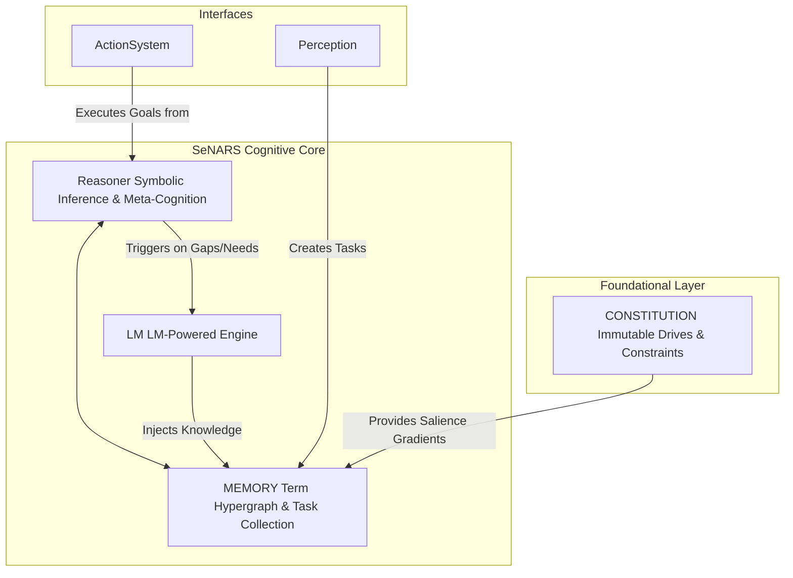
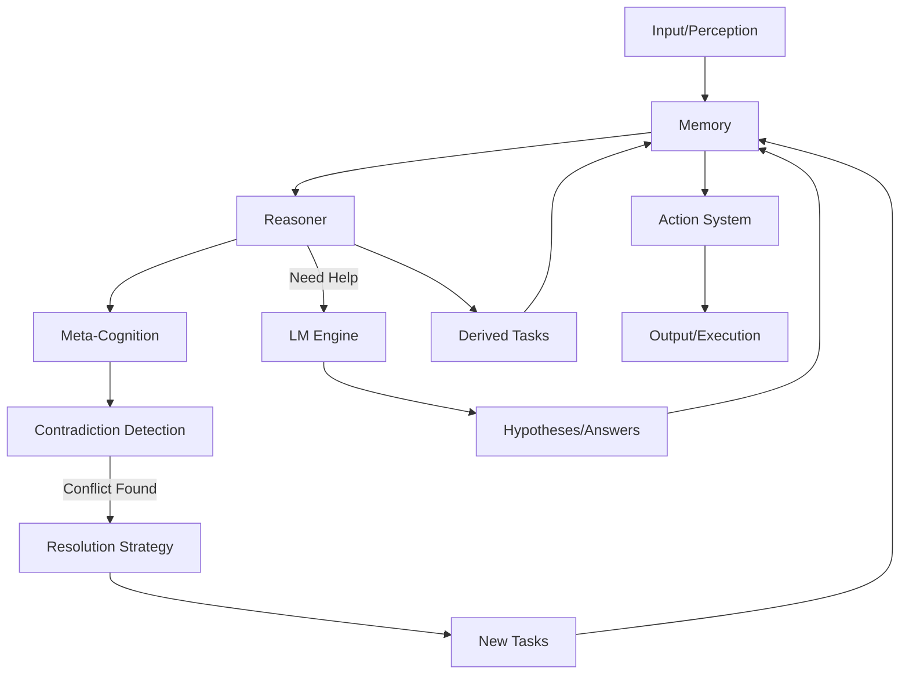
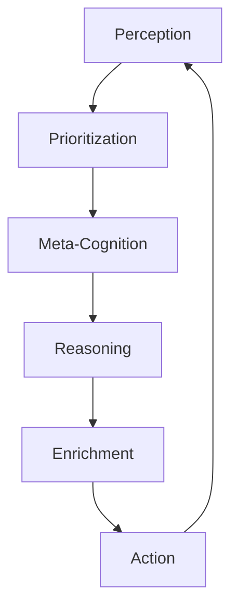
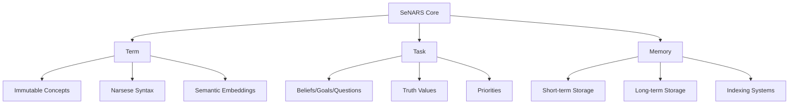
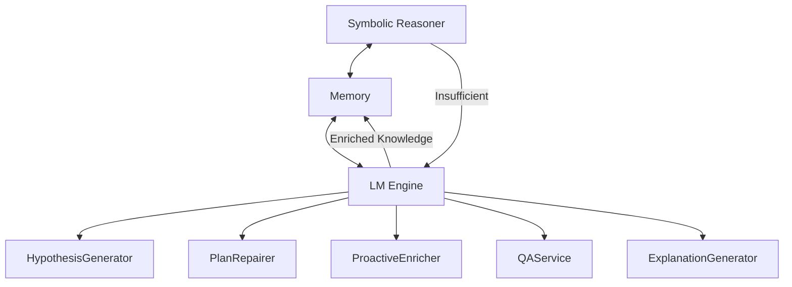
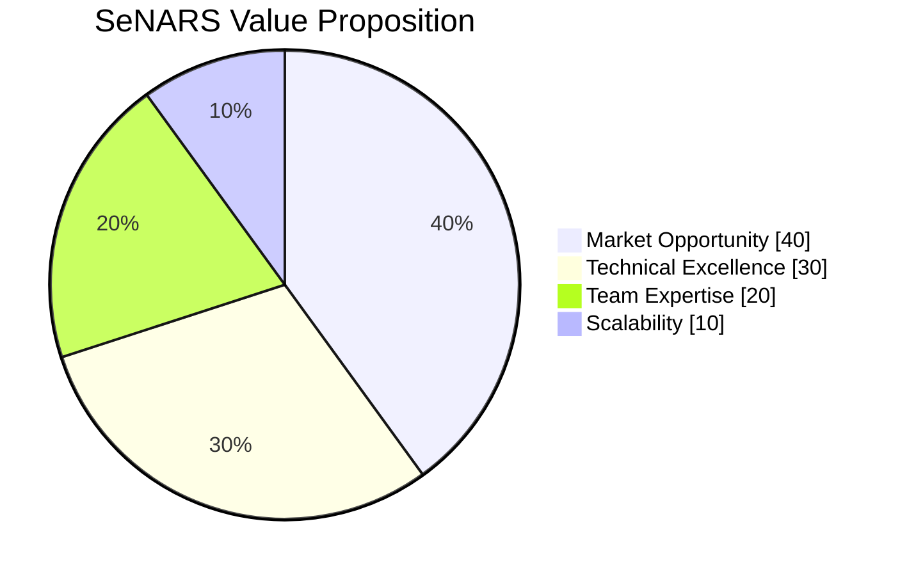

# **SeNARS Cognitive System**

Principled and Pragmatic Neuro-Symbolic Cognition

---

## Table of Contents
<Toc />

---

## **Welcome to SeNARS** 🧠

A complete cognitive architecture designed for a synergistic union of:
- **Formal symbolic reasoning**
- **Semantic power of Large Language Models (LMs)**

Today we'll explore how SeNARS combines the best of both worlds to create a transparent, reliable, and adaptive AI system.

<div class="center text-sm">
This presentation is designed to be educational and commercially persuasive,
building understanding from foundational concepts to advanced capabilities.
</div>

---

## **Welcome to SeNARS** 🧠

A complete cognitive architecture designed for a synergistic union of:
- **Formal symbolic reasoning**
- **Semantic power of Large Language Models (LMs)**

Today we'll explore how SeNARS combines the best of both worlds to create a transparent, reliable, and adaptive AI system.

---

## **The Challenge with Modern AI** 🤔

Today's powerful AI models often suffer from critical limitations:

- 📦 **Black Box Problem**: "Why did it do that?" is often unanswerable
- 📉 **Instability**: Minor input changes can cause catastrophic failures
- 🧩 **Poor Abstract Reasoning**: Struggles with logic, causality, and long-term planning

These limitations create massive barriers to deploying AI in high-value, regulated industries.

---

## **What is Neuro-Symbolic AI?** 🧠

Neuro-symbolic AI combines the best of both worlds:

| Approach | Strengths | Limitations |
|---------|-----------|-------------|
| **Neural Networks** | Pattern recognition, uncertainty handling, unstructured data | Opaque, unstable, poor abstract reasoning |
| **Symbolic AI** | Logical reasoning, knowledge representation, explainability | Rigid, limited creativity, brittle |

The integration creates systems that are:
- ✅ More interpretable than pure neural approaches
- ✅ More flexible than purely symbolic systems
- ✅ Better at generalizing from limited examples
- ✅ Capable of both intuitive and logical reasoning

---

## **Introducing SeNARS** 💡

SeNARS is a **neuro-symbolic** architecture that delivers **explainable, robust, and adaptive AI**.

Key differentiators:
- **Transparent Reasoning**: Trace every conclusion back to its premises
- **Immutable Constitution**: Ensures alignment with core principles
- **Self-Correction**: Reasons about its own failures and improves
- **True Synergy**: Symbolic reasoning + LM creativity ≠ Black box

**SeNARS is built for high-stakes applications where trust is non-negotiable.**

---

## **Market Opportunity** 📈

Explainable AI (XAI) is the key to unlocking high-value markets:

| Market | Value | Why XAI Matters |
|--------|-------|-----------------|
| **Financial Services** | $10B+ | Algorithmic trading, credit scoring, compliance |
| **Healthcare & Life Sciences** | $15B+ | Medical diagnosis, drug discovery, personalized medicine |
| **Autonomous Systems** | $20B+ | Self-driving vehicles, robotics, industrial automation |

**SeNARS captures these markets where standard "black-box" solutions are too risky.**

---

## **SeNARS Competitive Edge** 🎯

| Feature | Pure LLMs | Traditional Symbolic AI | **SeNARS** |
|---------|-----------|-------------------------|------------|
| **Explainability** | ⬛️ Low | ✅ High | ✅ **High** |
| **Adaptability** | 🟨 Medium | ⬛️ Low | ✅ **High** |
| **Creativity** | ✅ High | ⬛️ Low | ✅ **High** |
| **Logical Rigor** | 🟨 Medium | ✅ High | ✅ **High** |
| **Verdict** | ✨ Creative but Unreliable | 🧱 Rigid but Explainable | ✅ **Transparent & Powerful** |

<div class="center text-lg">
SeNARS represents a fundamental advancement in AI architecture,
combining the best of symbolic and neural approaches.
</div>

---

## **SeNARS Design Principles** 🏗️

SeNARS is built on five core design principles that ensure robust, transparent, and adaptive cognition:

1. **Modularity and Decoupling** 🧩
   - Components communicate through a central `EventBus` rather than direct calls
   - Easier maintenance, testing, and extension

2. **Explicit State Management** 📦
   - All cognitive state is stored within `Task`s in the central `Memory` component
   - Single source of truth that's transparent and debuggable

3. **Strategy over Implementation** 🎯
   - Dynamic selection of the best algorithm for a given context
   - Easy to add new approaches without altering core logic

4. **Meta-Cognition as a First-Class Citizen** 🔄
   - Self-reflection and self-improvement are core components, not afterthoughts
   - System designed to analyze and correct its own reasoning processes

5. **Pragmatism under Scarcity** 💰
   - Assumes finite computational resources
   - Economic Attention ensures resources are allocated to the most salient activities

These principles form the foundation of SeNARS' robust architecture.

---

## **Understanding the SeNARS Architecture** 🏗️

At its core, SeNARS is built on a **Unified Knowledge Hypergraph**:

- **`Term`**: Immutable representations of concepts (e.g., `cat`, `(cat --> animal)`)
- **`Task`**: Stateful cognitive atoms (beliefs, goals, questions) about Terms
- **Memory**: Unified knowledge hypergraph managing Terms and Tasks



---

## **How SeNARS "Thinks"** 🤔

Think of SeNARS as a **digital brain** with distinct yet synergistic components:

1. **The Logical "Conscious Mind" (Reasoner)**
    - Handles formal, step-by-step reasoning
    - Analytical and auditable
    - Ensures every decision can be fully explained

2. **The Creative "Subconscious" (LM)**
    - Provides intuition and semantic understanding
    - Source of novel ideas and fluent language
    - Grounds symbolic knowledge in meaning

3. **The Self-Awareness (Meta-Cognition)**
    - Constantly checks for errors
    - Improves thinking over time
    - Ensures consistency and coherence



---

## **The Cognitive Cycle** 🔁

SeNARS operates in discrete cognitive cycles that emulate a stream of consciousness:

1. **Perception** 👁️: Ingest new information from the world
2. **Prioritization** 🎯: Apply economic attention to all tasks
3. **Meta-Cognition** 🔍: Detect and analyze reasoning failures
4. **Reasoning** 🧠: Perform inference on salient tasks
5. **Enrichment** 🌱: Process new terms and execute goals

Each cycle is a complete reasoning loop, ensuring continuous learning and adaptation.



---

## **Deep Dive: Core Components** 🧱

Let's explore the three fundamental building blocks of SeNARS:



---

## **Core Component 1: Term** 🔤

Immutable representations of concepts:
- **Examples**: `cat`, `(cat --> animal)`, `(cat ==> furry)`
- **Key Properties**:
  - Parses their own structure for efficiency
  - Grounded with semantic embeddings from LMs
  - Serve as the stable vocabulary of the system
- **Intelligence**: Not just data containers—parse their own Narsese key upon instantiation

```javascript
// Example Term creation
const cat = new Term('cat');
const inheritance = new Term('(cat --> animal)');
```

---

## **Core Component 2: Task** 🎯

Stateful cognitive atoms representing beliefs, goals, or questions:
- **Structure**:
  - `id`: Unique identifier
  - `termKey`: Foreign key to a Term
  - `punctuation`: `.`, `!`, or `?` (Belief, Goal, Question)
- **State**:
  - Truth values (frequency, confidence)
  - Dynamic priorities for attention allocation
  - Temporal stamps (creation, occurrence times)

```javascript
// Example Task creation
const belief = new Task(
  parseTerm('<cat --> animal>.'),
  '.',
  { frequency: 1.0, confidence: 0.9 }
);
```

---

## **Core Component 3: Memory** 💾

Unified knowledge hypergraph managing Terms and Tasks:
- **Dual Storage System**:
  - Short-term: Active tasks prioritized for immediate processing
  - Long-term: Consolidated tasks with high importance/confidence
- **Specialized Indexes**:
  - Belief Index: For efficient retrieval
  - Implication Index: For planning knowledge
  - Cost Index: For action costs
- **Forgetting Mechanisms**: Time-based pruning of expired tasks

---

## **Economic Attention Model** 💰

SeNARS implements a pragmatic attention mechanism that focuses computational resources like a stream of consciousness.

Priority calculation factors:
| Factor | Description | Impact |
|--------|-------------|--------|
| **Truth Value** | Confidence and frequency | Higher confidence = higher priority |
| **Complexity** | Structural complexity | Lower complexity = higher priority |
| **Relevance** | Relationship to active goals | More relevant = higher priority |
| **Temporal Factors** | Recency and urgency | More recent/urgent = higher priority |

This ensures efficient allocation of limited computational resources.

---

## **Formal Reasoning with Inference Rules** 📐

SeNARS implements rigorous, explainable reasoning through formal inference rules:

| Rule | Structure | Purpose |
|------|-----------|---------|
| **Deduction** | `<M --> P>, <S --> M> ⊢ <S --> P>` | Classical logical deduction |
| **Induction** | `<M --> P>, <M --> S> ⊢ <S --> P>` | Evidence-based generalization |
| **Abduction** | `<P --> M>, <S --> M> ⊢ <S --> P>` | Hypothesis generation |
| **Analogy** | `<M --> P>, <M <-> S> ⊢ <S --> P>` | Structure-preserving inference |
| **Modus Ponens** | `<P ==> Q>, <P> ⊢ <Q>` | Conditional reasoning |

Every conclusion can be traced back to its premises.

---

## **The Neuro-Symbolic Bridge** 🌉

SeNARS integrates LMs as a suite of specialized services, not a black box:

- **HypothesisGenerator**: Creative abduction and pattern discovery
- **PlanRepairer**: Novel solutions when plans fail
- **ProactiveEnricher**: Expanding knowledge graph based on new info
- **QAService**: Fluent natural language interaction
- **ExplanationGenerator**: Translate formal reasoning into natural language

This creates powerful synergy: the **Reasoner** provides rigor, while the **LM** provides creativity and grounding.



---

## **Meta-Cognition: Thinking About Thinking** 🔄

SeNARS is designed for **recursive self-improvement**:

1. **Detection**: Constantly scans for contradictions between new conclusions and existing beliefs
2. **Analysis**: Classifies conflicts and selects best resolution strategy
3. **Correction**: Generates new Tasks (e.g., Questions) with high priority to resolve inconsistencies

Contradiction resolution strategies:
| Strategy | Approach | Use Case |
|----------|----------|----------|
| **Revision** | Truth value revision | Directly conflicting beliefs |
| **Reconciliation** | Contextual resolution | Beliefs true in different contexts |
| **Evidence Gathering** | Generate questions | Need more information |
| **Temporal Analysis** | Time-based resolution | Temporal conflicts |
| **Causal Analysis** | Examine causal relationships | Causal contradictions |

---

## **Planning for Complex Goals** 🗺️

SeNARS supports multiple planning strategies for goal achievement:

| Strategy | Approach | Benefits |
|----------|----------|----------|
| **HTN (Hierarchical Task Network)** | Decompose complex goals into primitive actions | Structured, systematic planning |
| **A* Search** | Graph-based pathfinding with heuristics | Optimal solutions with custom weights |

Key features:
- Plan cost calculation
- Task difficulty assessment
- Dynamic strategy selection
- Plan validation (check if goals already achieved)

---

## **Temporal Reasoning** ⏰

SeNARS implements sophisticated temporal reasoning capabilities:

- **Temporal Relationship Inference**: Determine relationships between events
- **Pattern Detection**: Identify periodic and sequential patterns
- **Future Prediction**: Forecast future task occurrences
- **Anomaly Detection**: Identify temporal anomalies

Specialized temporal term types:
- **Predictive Implication**: `(task1 => task2)` - task1 predicts task2
- **Retrospective Implication**: `(task1 =/> task2)` - task1 implies task2 occurred after
- **Concurrent Implication**: `(task1 =<> task2)` - task1 and task2 occur concurrently

---

## **The Constitution: Immutable Foundation** 🏛️

The **`Constitution`** defines the system's core motives and safety constraints:

**Core Drives** (High-priority, permanent goals):
- `AcquireKnowledge!` - Fundamental drive to learn and understand
- `ReduceUncertainty!` - Drive to resolve unknowns and ambiguities
- `MaintainCoherence!` - Drive to resolve contradictions and maintain consistency
- `MaintainCognitiveIntegrity!` - Meta-cognitive drive for self-improvement

**Safety Constraints** (Immutable beliefs about negative outcomes):
- `((&, self, cause_harm) ==> NEGATIVE_OUTCOME).`

The `Constitution` bootstraps the attention mechanism and anchors behavior to foundational principles.

---

## **Narsese: Formal Knowledge Representation** 🔤

SeNARS supports a comprehensive set of Narsese expressions:

| Type | Syntax | Example |
|------|--------|---------|
| **Atomic Terms** | Simple identifiers | `cat` |
| **Inheritance** | `<subject --> predicate>` | `(cat --> mammal)` |
| **Implication** | `<premise ==> conclusion>` | `(cat ==> furry)` |
| **Negation** | `(--, term)` | `(--, cat)` |
| **Conjunction** | `(&, term1, term2, ...)` | `(&, cat, dog)` |
| **Disjunction** | `(||, term1, term2, ...)` | `(||, cat, dog)` |
| **Extensional Difference** | `(#, term1, term2)` | `(#, cat, dog)` |
| **Intensional Difference** | `(\, term1, term2)` | `(\, cat, dog)` |
| **Instance** | `(term {-- class)` | `(cat {-- animal)` |
| **Property** | `(term --} property)` | `(cat --} furry)` |
| **Nested Expressions** | Complex combinations | `(cat --> (&, furry, intelligent))` |

This formal language enables precise knowledge representation and logical reasoning.

---

## **Implementation Details** ⚙️

SeNARS is implemented with modern software engineering practices:

- **Language**: JavaScript/Node.js for cross-platform compatibility
- **Architecture**: Event-driven design with decoupled components
- **Performance**: Probabilistic data structures for efficient task selection
- **Extensibility**: Plugin architecture for adding new capabilities
- **Testing**: Comprehensive unit and integration tests
- **Documentation**: Self-documenting code with inline examples

Key implementation features:
- Term parsing caching for performance optimization
- Bag data structure for probabilistic priority selection
- Lazy evaluation of complex term structures
- Batch processing for embedding generation
- Memory management with forgetting strategies

These implementation details ensure SeNARS is both powerful and practical.

---

## **Development Roadmap** 🛣️

**Track 1: Core Cognition & Self-Improvement**
- Short-Term: Self-tuning planners & predictive inference
- Mid-Term: Principled goal refinement & cognitive sandboxing
- Long-Term: Auditable Constitution evolution

**Track 2: Knowledge Architecture & Scalability**
- Short-Term: Vector database for rapid semantic retrieval
- Mid-Term: Hybrid memory system & cognitive delegation
- Long-Term: Decentralized knowledge graph federation

**Track 3: Cognitive Tooling & Autonomous Development**
- Short-Term: Interactive cognitive visualizer
- Mid-Term: Self-diagnosis of unit test failures
- Long-Term: Cognitive App Store & self-documentation

---

## **Symbiotic Intelligence & Interfaces** 🤝

**Track 4: Symbiotic Intelligence**
- Short-Term: Explainable AI (XAI) narratives
- Mid-Term: Mixed-initiative collaborative reasoning
- Long-Term: Proactive cognitive augmentation

**Track 5: Future Enhancements**
- Enhanced meta-cognition
- Advanced LM capabilities
- Complex perception interfaces
- Extended action execution
- Improved temporal reasoning

<div class="center text-sm">
These tracks focus on making SeNARS a true cognitive partner that works symbiotically with humans,
enhancing rather than replacing human intelligence.
</div>

---

## **Getting Started with SeNARS** 🚀

Ready to explore SeNARS? Here's how to get started:

### **Prerequisites**
- Node.js (v14 or higher)
- npm package manager

### **Installation**
```bash
npm install
```

### **Running Demos**
```bash
npm run start:demo
```
Explore various demos that showcase SeNARS capabilities:
- Math Inference Demo
- Planning Demo
- Comprehensive System Demo
- NLP Integration Demo
- Contradiction Resolution Demo

### **Running Tests**
```bash
npm test
```

### **Usage as a Library**
```javascript
const { System } = require('./src');
const { Task } = require('./src/core/Task');
const { parseTerm } = require('./src/parser/narseseParser');

// Initialize system, add knowledge, run cycles
```

SeNARS is designed to be both a standalone system and an embeddable library.

---

## **Investor-Ready Highlights** 💰

SeNARS is designed from the ground up to deliver value and attract investment:

- 📈 **Built to Scale**: Clear architectural path to enterprise-level workloads
- 💰 **High-Value Markets**: Targeting lucrative opportunities in XAI, Cognitive Automation, and Safe AI
- 👨‍💻 **Attracts Top Talent**: Clean, modular, well-documented design that developers love
- 📊 **Clear Path to ROI**: Research agenda focused on delivering commercial value at every step



<div class="center text-lg">
SeNARS represents a unique investment opportunity at the intersection
of cutting-edge AI research and practical commercial applications.
</div>

---

## **Verified Capabilities** ✅

All SeNARS functionality has been verified through comprehensive unit tests and runnable demos:

### **Core Knowledge Representation**
- Immutable Term system with intelligent parsing
- Task system with truth value management and priority calculation
- Semantic grounding with vector embeddings

### **Reasoning Engine**
- Formal inference with deduction, induction, abduction, and analogy
- Contradiction detection with multiple resolution strategies
- Hierarchical Task Network (HTN) and A* planning

### **Advanced Features**
- Temporal reasoning with pattern detection and future prediction
- Neuro-symbolic integration with hypothesis generation and explanation
- Economic attention model with probabilistic task selection

### **Demonstrated Capabilities**
- Inheritance chaining and modus ponens inference
- Contradiction detection and resolution
- Multi-step planning with complex goal decomposition
- Self-reflection and self-improvement mechanisms

These capabilities represent a solid foundation for building robust, explainable AI systems.

---

## **Implementation Details** ⚙️

SeNARS is implemented with modern software engineering practices:

- **Language**: JavaScript/Node.js for cross-platform compatibility
- **Architecture**: Event-driven design with decoupled components
- **Performance**: Probabilistic data structures for efficient task selection
- **Extensibility**: Plugin architecture for adding new capabilities
- **Testing**: Comprehensive unit and integration tests
- **Documentation**: Self-documenting code with inline examples

Key implementation features:
- Term parsing caching for performance optimization
- Bag data structure for probabilistic priority selection
- Lazy evaluation of complex term structures
- Batch processing for embedding generation
- Memory management with forgetting strategies

These implementation details ensure SeNARS is both powerful and practical.

---

## **Our Team** 👨‍💻👩‍💻

- **[Founder Name]** - CEO & Chief Architect
    - *Ex-Google AI, PhD in Cognitive Science, visionary behind the SeNARS architecture.*
- **[Co-Founder Name]** - CTO
    - *Serial entrepreneur with two successful exits, expert in building scalable, mission-critical systems.*
- **[Key Advisor Name]** - Advisor
    - *World-renowned Professor of AI Ethics & Safety at Stanford University.*

**We have the vision and expertise to make SeNARS the new standard for trustworthy AI.**

---

## **Thank You** 🙏

### Questions?
