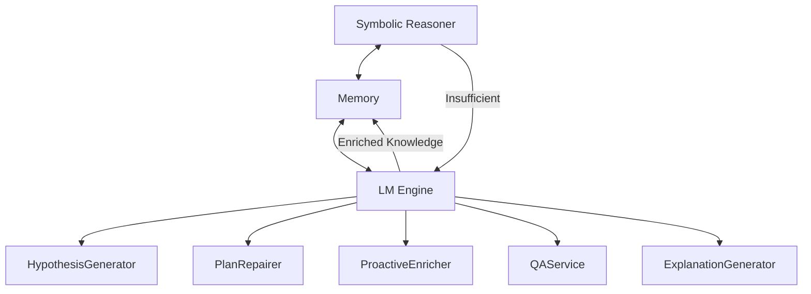

# Neuro-Symbolic Integration 🤝

How SeNARS bridges formal reasoning and neural processing.

---

## Architecture Overview

SeNARS integrates LMs as specialized services, not a black box.



---

## LM Services

### HypothesisGenerator 🧠
Creative abduction and pattern discovery

- Generates novel hypotheses when logic reaches limits
- Creates creative solutions for complex problems

### PlanRepairer 🛠️
Novel solutions when plans fail

- Suggests alternative approaches for failed plans
- Creative problem-solving for execution failures

### ProactiveEnricher 🌱
Expanding knowledge graph based on new info

- Automatically enriches concepts with semantic understanding
- Proactively identifies related knowledge

### QAService ❓
Fluent natural language interaction

- Answers questions about system state
- Provides natural language interface

### ExplanationGenerator 📝
Translate formal reasoning into natural language

- Converts symbolic logic to human-readable text
- Provides fluent narratives of reasoning processes

---

## Integration Patterns

### Gap Detection
Reasoner identifies knowledge gaps → Triggers LM services

### Creative Injection
LM generates novel ideas → Injects into Memory

### Explanation Generation
Formal proofs → Natural language explanations

---

## Configuration

```javascript
const config = {
  LM: {
    LLM_PROVIDER: 'xenova',        // or 'ollama'
    TEXT_GENERATION_MODEL: 'Xenova/distilgpt2',
    FEATURE_EXTRACTION_MODEL: 'Xenova/all-MiniLM-L6-v2'
  }
};
```

---

## Benefits

| Benefit | Description |
|---------|-------------|
| **Rigor** | Formal logical reasoning |
| **Creativity** | Semantic understanding and generation |
| **Explainability** | Traceable decisions with NL explanations |
| **Adaptability** | Dynamic knowledge enrichment |
| **Synergy** | Combined strengths ≠ Black box |