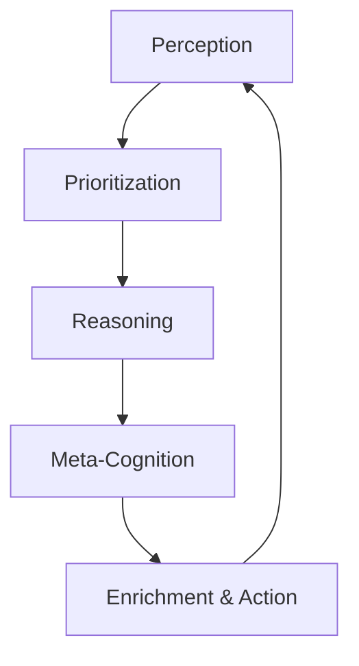

# SeNARS: Conceptual Overview 🧠

A deeper look at the system's architecture for developers.

---

## Core Philosophy

SeNARS emulates a pragmatic **"stream of consciousness"** under **finite resources**.

Key principle: **Economic Attention**  
Every `Task` gets a priority based on relevance, urgency, and confidence.

---

## The Three Pillars

### 🔤 Term: Vocabulary of Thought
Immutable representation of a concept

- **Examples**: `cat`, `(cat --> animal)`, `((&, cat, furry) ==> friendly)`
- **Immutable**: Stable concepts throughout system lifetime
- **Intelligent Design**: Self-parsing for efficient access

### 🎯 Task: Atoms of Cognition
Stateful unit of cognitive work

Structure:
- Wraps a `Term`
- Punctuation: `.` (belief), `!` (goal), `?` (question)

State:
- **Truth Value**: Confidence score
- **Priority**: Importance in cognitive cycle
- **Temporal Stamps**: Creation & access times

### 💾 Memory: Knowledge Hypergraph
Central hub storing Terms & Tasks

- **Dual Storage**: Short-term ↔ Long-term
- **Specialized Indexing**: Fast retrieval (e.g., implications)
- **Forgetting Mechanism**: Prunes irrelevant information

---

## Cognitive Cycle 🔄

The system "thinks" in discrete loops:

1. **Perception**: Convert external info to `Task`s
2. **Prioritization**: Calculate `Task` priorities
3. **Reasoning**: Apply inference rules
4. **Meta-Cognition**: Detect & resolve failures
5. **Enrichment**: LM insights & action execution

---

## Neuro-Symbolic Synergy 🤝

LM is integrated as specialized services, not a black box.

| Service | Purpose |
|---------|---------|
| **Hypothesis Generation** | Creative leaps when logic reaches limits |
| **Plan Repair** | Alternative solutions for failed plans |
| **Explanation** | Translate formal logic to natural language |

**Synergy**:  
🧠 Reasoner = Rigor, structure, explainability  
🤖 LM = Semantic understanding, creativity, fluency
