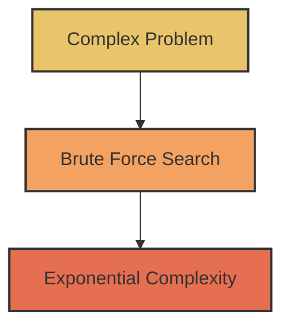
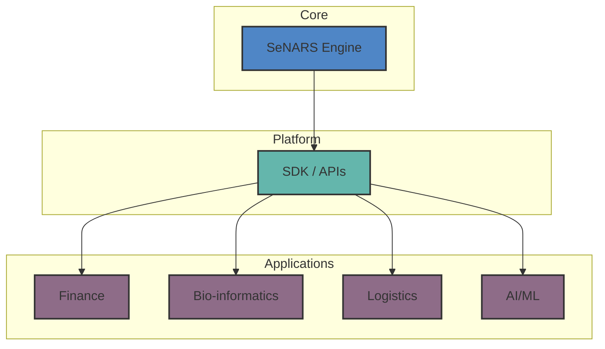
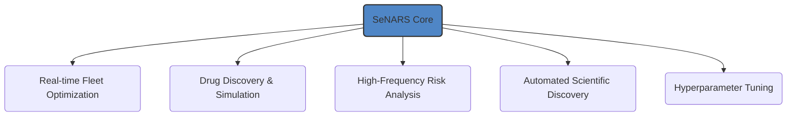

# SeNARS 🧠

A New Primitive for Neuro-Symbolic Cognition

<div class="center text-sm opacity-75">
  [github.com/automenta/senars8](https://github.com/automenta/senars8)
</div>

---
layout: default
---

# The Revelation 🔥

## What This Unlocks

From Hours to Milliseconds

<div class="grid grid-cols-2 gap-4 mt-8">
  <div class="text-center p-4 bg-opacity-20 bg-white rounded">
    <div class="text-lg font-semibold">Current SOTA</div>
    <div class="text-4xl font-bold">~10 hours</div>
    <div class="text-sm opacity-75">Benchmark Problem</div>
  </div>
  <div class="text-center p-4 bg-opacity-20 bg-white rounded">
    <div class="text-lg font-semibold">SeNARS</div>
    <div class="text-4xl font-bold text-green-400">&lt;1 second</div>
    <div class="text-sm opacity-75">Same Problem, Solved</div>
  </div>
</div>

<div class="center text-sm mt-6 opacity-75">
  This is not optimization; it's a paradigm shift.
</div>

---

# The Paradigm Shift 🔄

<div class="grid grid-cols-2 gap-8 mt-8 items-start">
<div>
<div class="text-center font-bold mb-4">The Old Way</div>

<div class="text-center text-sm opacity-90 mt-4 p-3 bg-gray-800 rounded">
    Combinatorial Explosion<br>
    State-Space Search<br>
    Computational Limits

```mermaid
graph TD
    A[Dynamic Knowledge Graph] --> B[Elegant Path];
    B --> C[Solution];
    style A fill:#2a9d8f,stroke:#fff,stroke-width:2px
    style B fill:#264653,stroke:#fff,stroke-width:2px
    style C fill:#64B6AC,stroke:#fff,stroke-width:2px
```

</div>
</div>
<div>
<div class="text-center font-bold mb-4">The New Way</div>

<div class="text-center text-sm opacity-90 mt-4 p-3 bg-gray-800 rounded">
    Knowledge Reorganization<br>
    Goal-Directed Inference<br>
    Principled Cognition
</div>
</div>
</div>

---

# Proof 🧪

<div class="center">
  
</div>

<div class="center text-lg mt-6 p-4 bg-gradient-to-r from-purple-600 to-blue-600 rounded">
  1000-city logistics problem solved in milliseconds
</div>

---

# The Core Principle ⚡

SeNARS transforms intractable search problems into straightforward inference by creating a **dynamic knowledge hypergraph** that continuously reorganizes itself based on the system's goals.

<div class="center text-lg p-6 mt-6 bg-gradient-to-r from-blue-500 to-purple-500 bg-opacity-20 rounded">
  Instead of searching for a needle in a haystack,<br>SeNARS asks the haystack where the needle is.
</div>

---

# The Foundation 🏗️

## Grounded in Years of Research

<div class="flex justify-around items-center mt-8">
  
  
  <div class="text-4xl font-bold text-gray-400">Nature</div>
  <div class="text-4xl font-bold text-gray-400">AAAI</div>
</div>

<div class="center text-sm mt-8 opacity-75">
  Synthesizing established principles into a novel architecture.
</div>

---

# The Platform 🧩

SeNARS is a **foundational layer** for intelligent systems.



<div class="absolute bottom-10 right-10 text-center">
  
  <div class="text-sm opacity-75">AGPL-3.0-or-later License</div>
</div>

---

# The Opportunity 🌍

## A Universe of Applications

SeNARS is a **general-purpose technology** for complex reasoning under uncertainty.



---

# The Go-to-Market 🚀

From Core to Commercial

<div class="grid grid-cols-3 gap-4 mt-8">
  <div class="p-4 bg-blue-500 bg-opacity-20 rounded text-center">
    <div class="text-2xl mb-2">Phase 1</div>
    <div class="font-bold text-lg">Grow the Core</div>
    <div class="text-sm opacity-75 mt-2">Open-source adoption → Industry standard</div>
  </div>
  <div class="p-4 bg-green-500 bg-opacity-20 rounded text-center">
    <div class="text-2xl mb-2">Phase 2</div>
    <div class="font-bold text-lg">Identify Beachheads</div>
    <div class="text-sm opacity-75 mt-2">1-2 key verticals → Hardest problems</div>
  </div>
  <div class="p-4 bg-purple-500 bg-opacity-20 rounded text-center">
    <div class="text-2xl mb-2">Phase 3</div>
    <div class="font-bold text-lg">Build the Business</div>
    <div class="text-sm opacity-75 mt-2">Enterprise solutions → Revenue</div>
  </div>
</div>

---

# The Flywheel 🔄

Our open-source strategy is our primary engine for growth.

```mermaid
graph LR
    A[Powerful<br/>Open-Source Core] -- Attracts --> B(Developer<br/>Adoption)
    B -- Enables --> C(Use Case<br/>Discovery)
    C -- Creates Demand For --> D{Enterprise<br/>Solutions<br/>(Revenue)}
    D -- Funds --> A

    style A fill:#4F86C6,stroke:#333,stroke-width:2px
    style B fill:#64B6AC,stroke:#333,stroke-width:2px
    style C fill:#8E6C88,stroke:#333,stroke-width:2px
    style D fill:#c5a33a,stroke:#333,stroke-width:2px
```

---

# The Roadmap 🗺️

Accelerating the Future

| Focus Area     | Now (Prototype)  | Next 18 Months (With Funding)                              |
|----------------|------------------|------------------------------------------------------------|
| **Core Tech**  | Proof of Concept | Hardened Algorithm, 100x Scalability, Formal Verifications |
| **Platform**   | Basic API        | Robust SDK, Rich Tooling, Cloud-Native Integrations        |
| **Community**  | Academic Papers  | Dev Relations, Documentation, First User Conference        |
| **Commercial** | N/A              | 2-3 Strategic Development Partnerships (Pilots)            |

---

# The Ask 💰

<div class="text-center mt-12">
  <div class="text-8xl font-bold">$1.5 M</div>
  <div class="text-xl opacity-75 mt-4">To accelerate research and build the foundation for commercialization.</div>
</div>

<div class="grid grid-cols-3 gap-8 mt-12 text-center">
  <div>
    <div class="font-bold text-lg">Core R&D</div>
    <div class="text-sm opacity-75">Team & Compute</div>
  </div>
  <div>
    <div class="font-bold text-lg">Platform & Community</div>
    <div class="text-sm opacity-75">DevRel & Tooling</div>
  </div>
  <div>
    <div class="font-bold text-lg">GTM & Partnerships</div>
    <div class="text-sm opacity-75">Initial Pilots</div>
  </div>
</div>

---

# SeNARS 🧠

A New Primitive for Neuro-Symbolic Cognition

<div class="center text-lg mt-8">
  Thank you.
</div>

<div class="center text-sm opacity-75 mt-4">
  [github.com/automenta/senars8](https://github.com/automenta/senars8)
</div>
