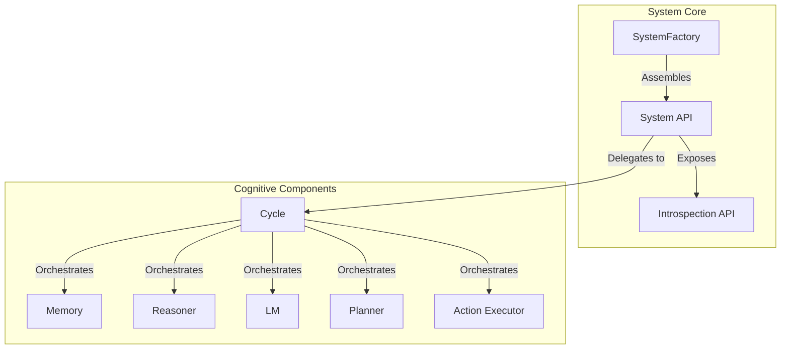
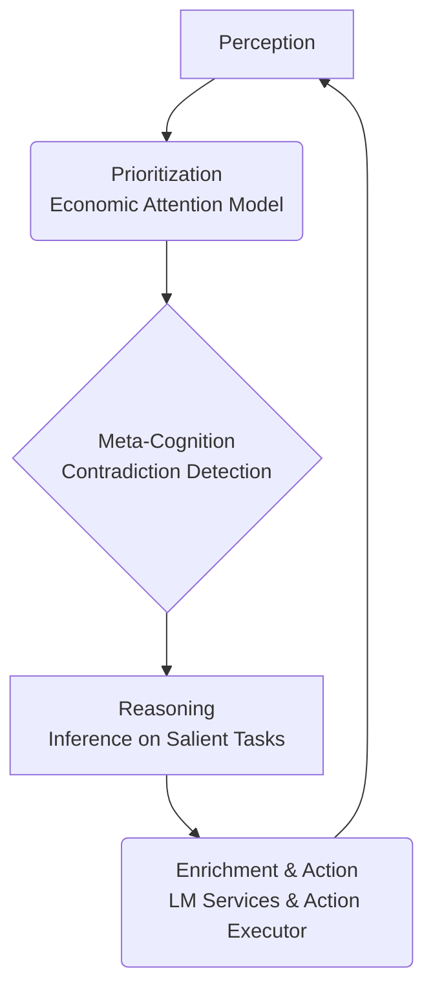
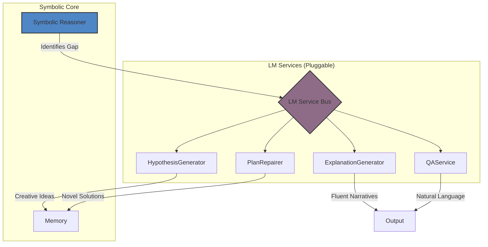

# SeNARS

## A Technical Deep Dive

  For Developers and Researchers

---

# Agenda

1. **Core Architecture & Philosophy**
2. **The Cognitive Cycle: How SeNARS "Thinks"**
3. **Knowledge Representation: Narsese Grammar**
4. **The Neuro-Symbolic Bridge in Detail**
5. **Advanced Reasoning: Temporal & Planning**
6. **Getting Involved: The Development Roadmap**

---

# 1. Core Architecture & Philosophy

- **Pragmatism under Scarcity**: The system operates under the assumption of finite computational resources.
- **Economic Attention**: A priority system that directs focus to the most salient `Task`s.
- **Unified Knowledge Hypergraph**: All `Term`s and `Task`s reside in a central `Memory` component.
- **Modularity & Extensibility**: Components are decoupled and assembled by a `SystemFactory`.

---

# The Three Pillars: Term, Task, Memory

  

    
Term

    
🔤

    
An **immutable** representation of a concept. The stable vocabulary of the system.

    
`(cat --> animal)`

  

  

    
Task

    
🎯

    
A **stateful** unit of cognitive work (belief, goal, or question) with dynamic priority.

    
`Task { term: "(cat --> animal)", punc: '.', truth: { f:1, c:0.9 } }`

  

  

    
Memory

    
💾

    
The central **knowledge hypergraph** with specialized indexes and a forgetting mechanism.

    
`Memory { terms: [...], tasks: [...] }`

  

---

# 2. The Cognitive Cycle

The system "thinks" in a discrete loop that orchestrates all cognitive processes.

| Phase              | Description                                                                      |
|--------------------|----------------------------------------------------------------------------------|
| **Perception**     | Ingests new information from the environment into `Task`s.                       |
| **Prioritization** | Calculates the priority of all `Task`s in `Memory`.                              |
| **Meta-Cognition** | Scans for contradictions and reasoning failures, generating goals to fix them.   |
| **Reasoning**      | Applies formal inference rules to high-priority `Task`s to derive new knowledge. |
| **Enrichment**     | Triggers LM services for creative input or executes `Action`s on achieved goals. |

---

# 3. Knowledge Representation: Narsese

SeNARS uses a rich, formal grammar called Narsese to represent knowledge with precision.

| Type                     | Syntax                     | Example                            | Purpose                                 |
|--------------------------|----------------------------|------------------------------------|-----------------------------------------|
| **Inheritance**          | `<subject --> predicate>`  | `(cat --> mammal)`                 | Represents an "is-a" relationship.      |
| **Implication**          | `<premise ==> conclusion>` | `(raining ==> wet_streets)`        | Represents a predictive or causal link. |
| **Conjunction**          | `(&, term1, term2, ...)`   | `(&, cat, furry)`                  | Represents a logical AND.               |
| **Negation**             | `(--, term)`               | `(--, cat)`                        | Represents logical NOT.                 |
| **Temporal Implication** | `<premise =/> conclusion>` | `(see_lightning =/> hear_thunder)` | Represents a temporal sequence.         |

This formal grammar is the foundation for the system's rigorous, explainable reasoning capabilities.

---

# 4. The Neuro-Symbolic Bridge

The LM is not a black-box brain; it's a suite of specialized services orchestrated by the symbolic core.

The **Reasoner** maintains control, calling on the **LM** for specific tasks like generating creative hypotheses when
logic reaches an impasse, or translating formal proofs into human-readable text.

---

# 5. Advanced Reasoning

### Temporal Reasoning

SeNARS has specialized mechanisms for reasoning about time.

- **Temporal Relationship Inference**: Determines relationships between events (before, after, concurrent).
- **Pattern Detection**: Identifies periodic and sequential patterns in data.
- **Future Prediction**: Forecasts future `Task` occurrences based on learned temporal implications.

### Planning

The system supports multiple planning strategies, selectable via configuration.

- **HTN (Hierarchical Task Network)**: The default planner, which decomposes complex goals into primitive, executable
  actions. It's robust and well-suited for structured problems.
- **A* Search**: An experimental, heuristic-based planner that can find optimal paths in a state space.

---

# 6. Development Roadmap & Getting Involved

We are actively working on several key areas to enhance the system's capabilities.

  

    
Core Cognition & Self-Improvement

    <ul class="text-sm space-y-1 list-disc list-inside">
      <li>Self-tuning planners</li>
      <li>Principled goal refinement</li>
      <li>Auditable Constitution evolution</li>
    </ul>
  

  

    
Knowledge Architecture & Scalability

    <ul class="text-sm space-y-1 list-disc list-inside">
      <li>Vector database integration</li>
      <li>Hybrid memory systems</li>
      <li>Decentralized knowledge federation</li>
    </ul>
  

We welcome contributions! Please see the `README.md` for details on how to get started.

---

# Q&A

  Thank you.

  [github.com/automenta/senars8](https://github.com/automenta/senars8)

